# Final Lab: Campus Network Simulation

## 综合实验：基于 Packet Tracer 的校园网仿真模拟实验

* **成员分工**：
  | 姓名 | 学号 | 分工 | 工作量 |
  | :---: | :---: | :---: | :---: |
  | 林继申 (组长) | 2250758 | 网络设计、网络测试、实验报告、答辩PPT | 25% |
  | 杜天乐 | 2251310 | 网络设计、网络测试、实验报告、答辩PPT | 25% |
  | 刘淑仪 | 2251730 | 网络设计、网络测试、实验报告、答辩PPT | 25% |
  | 吴婉宁 | 2252443 | 网络设计、网络测试、实验报告、答辩PPT | 25% |
* **指导教师**：陈伟超
* **实验地点**：济事楼 330
* **实验时间**：2024 年 5 月 30 日 ~ 2024 年 6 月 12 日
* **答辩时间**：2024 年 6 月 13 日

-------------------------------------------------------

## 1 问题描述

学校有若干部门，包括各个院系，科研部门，教务处，后勤部等，请为此设计网络架构，其中需要满足的功能有：

* 每个部门配置自己独立局域网，且包含自己的文件服务器和 Web 服务器，实现部门间的隔离和互访；
* 学校统一提供接入到互联网的接口（假设学校有一个公网 IPv4 地址 100.64.1.0/24），需配置 NAT 功能；
* 学校需提供一个外网可访问的 Web 服务器，以及一个各部门公用的文件服务器；
* 网络需提供 WiFi 接入功能；
* 科研部门须有访问接入控制 ACL 设计；
* 随机抓取（在 Packet Tracer 内）某类型的数据包并解读，如 TCP, IP, MAC, ARP 等（需现场演示）。

## 2 网络拓扑结构设计

### 2.1 总体网络拓扑图
根据需求，设计总体网络拓扑图如下所示：


整个网络结构分为内网和外网两大部分。
* 内网为主要部分，由核心层、软件学院（SSE）、财务处（Treasury）、行政管理部门（Admin）以及VOIP局域网五个子网构成，每个子网都承担着不同的功能，服务于特定的用户群体和业务需求。
* 外网可以与学校内网发邮件、访问公网IP等，校内用户也可以随时访问内网。

### 2.2 各部分网络拓扑图

#### 2.2.1 核心层
核心层部分的网络拓扑图如下所示：  
  

核心层是整个网络的核心，主要由核心交换机和5台服务器（School DHCP Server、School DNS Server、School Web Server、School File Server、School Email Server）组成，它们负责整个内网的数据交换和路由。核心层的设计需要确保高可用性和高带宽，以满足大量数据的高速传输需求。核心层中的E-mail服务器、DHCP服务器、Web服务器、DNS服务器以及File服务器均为内网公用服务器，可以被其他部门访问。

#### 2.2.2 软件学院SSE
软件学院的网络拓扑图如下所示：  
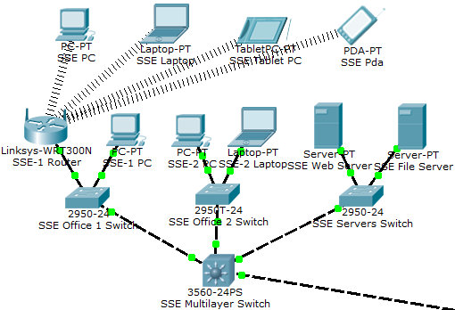   

这个子网服务于软件学院，其中包括了服务器、个人电脑、笔记本电脑和平板电脑等设备，为学生和教职工提供网络资源和服务。学院内还设置了Wifi服务，有无线路由器和无线接入点两种。软件学院与其他两个部门相互独立，无法相互访问。  

学院内设有两个工作室（SSE Office 1、SSE Office 2）和两台服务器（SSE Web Server、SSE File Server）。
* 工作室之间相互独立，例如SSE Office 1不能访问SSE Office 2。
* 两台服务器，一台是负责软件学院网络的Web服务器，另一台是负责文件传输的File服务器，都是软件学院内的公用服务器，其他部门无法访问。  

#### 2.2.3 财务处Treasury
财务处的网络拓扑图如下所示：  
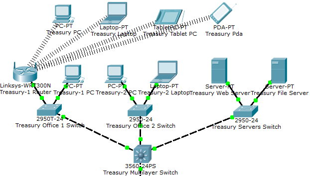  

这个子网专门为财务部门设计。与软件学院类似，财务处与其他两个部门相互独立，无法相互访问。财务处内还设置了Wifi服务，有无线路由器和无线接入点两种。  

部门内设有两个工作室（Treasury Office 1和Treasury Office 2）和两台服务器（Treasury Web Server和Treasury File Server）。  
* 工作室之间相互独立，例如Treasury Office 1不能访问Treasury Office 2。
* 两台服务器，一台是负责财务处网络的Web服务器，另一台是负责文件传输的File服务器，都是部门的公用服务器，其他部门无法访问。

#### 2.2.4 行政管理部门Admin
行政管理部门的网络拓扑图如下所示：  
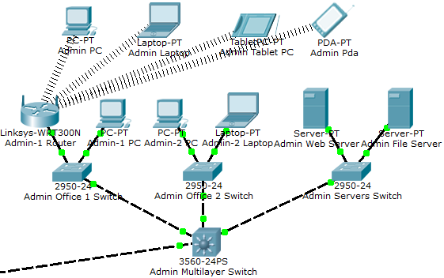  

这个子网为行政管理人员提供网络服务，包括处理日常行政事务的电脑和服务器。这些设备需要访问内网中的各种资源和应用程序，以支持管理工作。同上两个部门，行政管理部门与其他两个部门相互独立，无法相互访问。部门内设置了Wifi服务。  

部门内设有两个工作室（Admin Office 1和Admin Office 2）和两台服务器（Admin Web Server和Admin File Server）。  
* 工作室之间相互独立。
* 两台服务器，一台是负责财务处网络的Web服务器，另一台是负责文件传输的File服务器，都是部门的公用服务器，其他部门无法访问。

#### 2.2.5 VOIP局域网
VOIP局域网的网络拓扑图如下所示：  
  

这个子网是一个基于IP的语音通信网络，提供了IP电话服务，为每一个部门配备了电话。  
IP电话直接由网管路由器（Hallway Router）提供，不接入内网。从拓扑图上看，IP电话并不在各部门的子网中，但逻辑上每台电话都属于一个部门（SSE IP Phone属于软件学院，Treasury IP Phone属于财务处，Admin IP Phone属于行政管理部门）这样VOIP局域网不仅实现了各部门之间拨打和接通IP电话，还可以访问外网。  

网管路由器（Hallway Router）：   
Hallway Router提供NAT网络地址转换服务，它允许多个内部网络设备共享单个或少量公网IP地址。  
* 使用公网IP配置内网核心层的Web服务器和File服务器：  
  在这种情况下，Web服务器和File服务器被直接配置了公网IP地址。这两个服务器可以直接从互联网上访问，不需要通过NAT转换。外网用户可以通过这些公网IP地址直接访问这些服务器，就像访问任何其他互联网上的服务器一样。这种配置用于需要对外提供服务的服务器，它将Web服务器和File服务器开放给了外网，以便外部用户可以访问。  
* 给内网其余设备配备NAT池：  
  对于内网中的其他设备，它们被配置使用NAT池中的私有IP地址。当这些设备需要访问互联网时，它们的私有IP地址会被转换成NAT池中的公网IP地址之一。这种转换过程允许这些设备共享有限的公网IP地址。这样，即使公网IP地址数量有限，内网中的多个设备也可以访问互联网上的外部资源，如Web服务器、DNS服务器等。NAT池中的公网IP地址在设备访问互联网时被复用，每个设备的私有IP地址在出站流量中被替换为公网IP地址，同时记录下对应的端口信息，以便在响应流量返回时能够正确地转发回原始的内部设备。  

通过NAT服务，HallwayRouter有效地管理了公网IP地址的使用，确保了内网设备能够访问互联网，同时也保护了内部网络的安全性，因为私有IP地址不会直接暴露在公网上。

#### 2.2.6 外网
外网的网络拓扑图如下所示：   
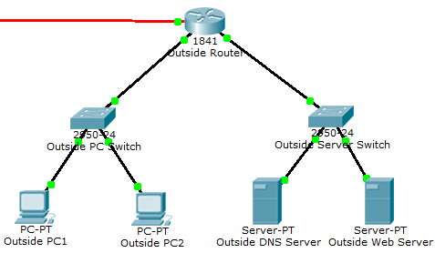

外网部分是将学校内网连接到外部网络，它允许内网用户访问外部资源，如互联网上的网站、电子邮件服务等。同时，外网也允许外部用户访问内网中配置了公网IP的服务器，如学校的Web服务器和文件服务器。外网通过路由器与内网相连，该路由器负责处理内网与外网之间的数据流，确保数据的安全传输。

## 3 核心层网络配置

### 3.1 VLAN配置
在设计过程中，我们通过配置虚拟局域网（VLAN）为各个部门建立独立的局域网，采用VLAN Trunking Protocol（VTP）协议来简化VLAN的管理和配置过程。  

首先将核心交换机（Core Multilayer Switch）配置为VTP的服务器server模式，让它成为VLAN数据库中中央管理点。  

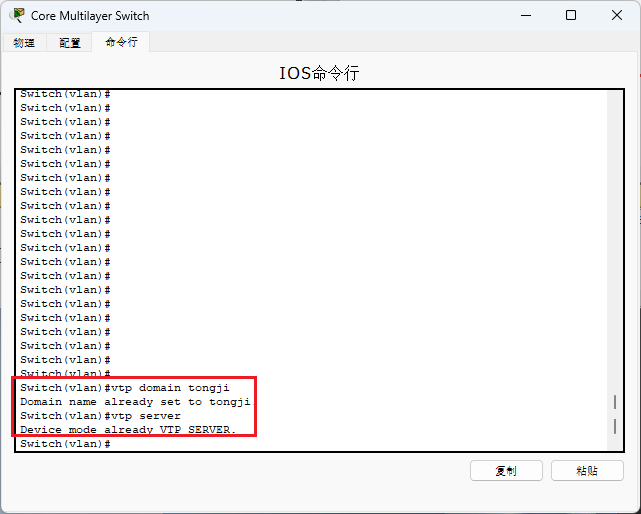  

接着在核心交换机上配置VLAN，确保所有VLAN的新增和更改都要先在核心交换机上完成   
添加各部门VLAN后（见各部门网络配置中的VLAN配置），可以通过核心交换机为其命名

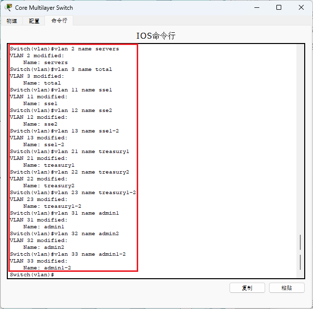

在核心交换机处添加VLAN2 'servers'，并查看VLAN配置信息

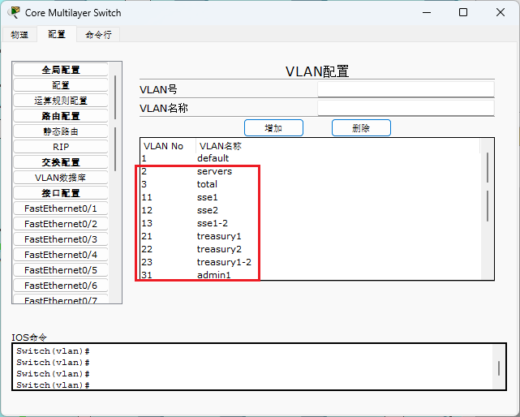


配置网络交换机（Core Multilayer Switch）端口

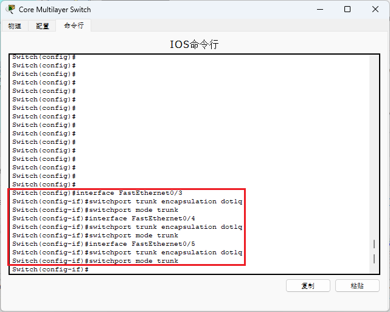

* switchport trunk encapsulation dot1q:   
  这条命令用于配置交换机端口使用dot1q封装格式。dot1q是一种广泛使用的VLAN标签协议，它允许在单个物理链路上传输多个VLAN的数据。这条命令确保了交换机端口使用标准的dot1q封装，以便能够正确地识别和处理通过该端口传输的VLAN标签。  
* switchport mode trunk:  
  这条命令将交换机端口设置为trunk模式。在trunk模式下，端口允许多个VLAN的数据通过，这对于连接两个交换机或者连接交换机到支持VLAN的设备（如路由器）是非常重要的。trunk模式允许多个VLAN的数据共享同一个物理链路，同时保持每个VLAN的独立性。  

配置后如下所示（以FastEthernet0/3接口为例）：
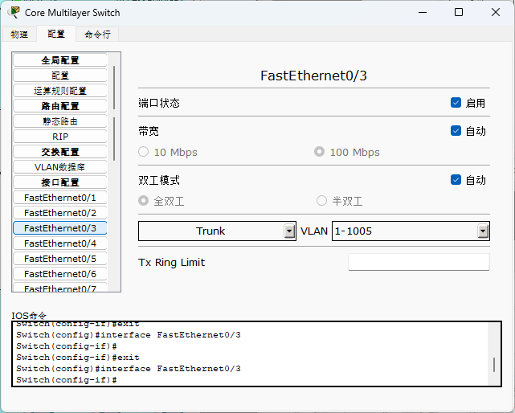  

将核心层的交换机（School Core Domain Switch）的FastEthernet0/1接口设置为Trunk模式：


将School Core Domain Switch的FastEthernet0/2-FastEthernet0/6接口设置为Access模式，并指定段扩所属的VLAN为VLAN 2（以FastEthernet0/2为例）：  


在核心交换机完成VLAN配置后，VTP服务器会自动将这些更新信息传播给所有处于VTP客户端模式的交换机。这样，整个网络中的交换机都能够保持VLAN信息的同步，确保每个部门都能拥有一个独立且安全的通信环境。  

### 3.2 配置核心层服务器静态IP
为了快速定位网络核心中的服务器，并且考虑到这些服务器通常较为稳定，不会频繁增减，我们为它们分配静态IP地址。以下是分配的详细情况：
  | 服务器 | 静态IP | 子网掩码 | 网关 | DNS |
  | :---: | :---: | :---: | :---: | :---: | 
  | School DHCP Server | 192.168.0.2 | 255.255.255.0 | 192.168.0.1 | 192.168.0.3 |
  | School DNS Server | 192.168.0.3 | 255.255.255.0 | 192.168.0.1 | 192.168.0.3 |
  | School Web Server | 192.168.0.4 | 255.255.255.0 | 192.168.0.1 | 192.168.0.3 |
  | School File Server | 192.168.0.5 | 255.255.255.0 | 192.168.0.1 | 192.168.0.3 |
  | School Email Server | 192.168.0.6 | 255.255.255.0 | 192.168.0.1 | 192.168.0.3 | 

### 3.3 DHCP
启用核心层DHCP服务器（School DHCP Server）的DHCP，还可以查看网络内的所有DHCP配置：


## 4 各部门网络配置

### 4.1 软件学院（SSE）网络配置

#### 4.1.1 VLAN配置
将软件学院交换机（SSE Multilayer Switch）配置为VTP的client模式，使得软件学院可以同步核心层的所有VLAN

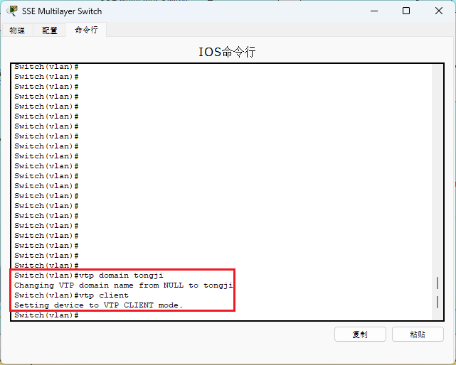

Vlan11、Vlan12、Vlan13，分别对应软件学院的三个虚拟局域网（SSE Office1、SSE Office2、SSE Servers）  
在核心交换机（Core Multilayer Switch）上为新建的3个VLAN配置IP地址，代码如下：
```
interface Vlan11
ip address 192.168.1.1 255.255.255.0
no shutdown
exit
interface Vlan12
ip address 192.168.2.1 255.255.255.0
no shutdown
exit
interface Vlan13
ip address 192.168.3.1 255.255.255.0
no shutdown
exit
```
Vlan11、Vlan12、Vlan13配置信息如下：
  | VLAN编号 | VLAN名称 | 局域网 | 网段 | DNS |
  | :---: | :---: | :---: | :---: | :---: | 
  | 11 | sse1 | 软件学院办公室1 | 192.168.1.1 | 255.255.255.0 |
  | 12 | sse2 | 软件学院办公室2 | 192.168.2.1 | 255.255.255.0 |
  | 13 | sse1-2 | 软件学院服务器 | 192.168.3.1 | 255.255.255.0 |

配置网络交换机（SSE Multilayer Switch）端口
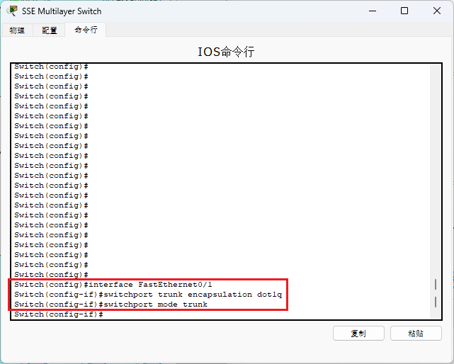   

将核心交换机到部门总交换机、部门总交换机到部门分交换机的接口设置为Trunk  
配置后如下所示（以FastEthernet0/1接口为例）：
 
 

将部门分交换机到终端的接⼝设置为Access,并选择对应VLAN
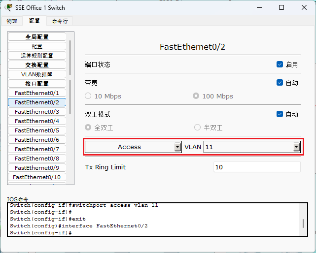
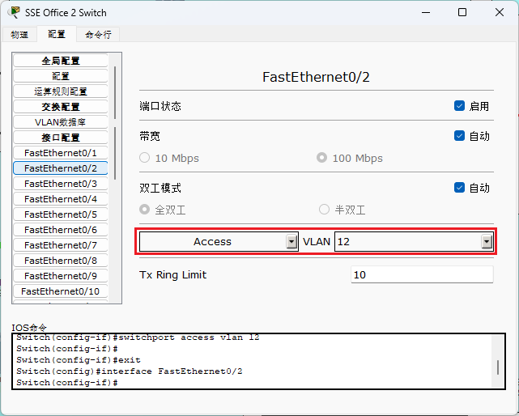


#### 4.1.2 ACL配置
ACL（访问控制列表）的主要功能是控制通过网络设备的数据流，通过允许或拒绝特定流量来保护和管理网络资源。  

针对服务器VLAN（VLAN13）：
* 允许同一部门内的VLAN（VLAN11和VLAN12）进行访问
* 拒绝其他部门VLAN对服务器VLAN的访问  

针对不同工作室：
* 允许部门服务器（VLAN13）访问
* 允许核心层服务器访问
* 拒绝其他部门VLAN访问
* 允许外部访问

在核心交换机配置如下：  
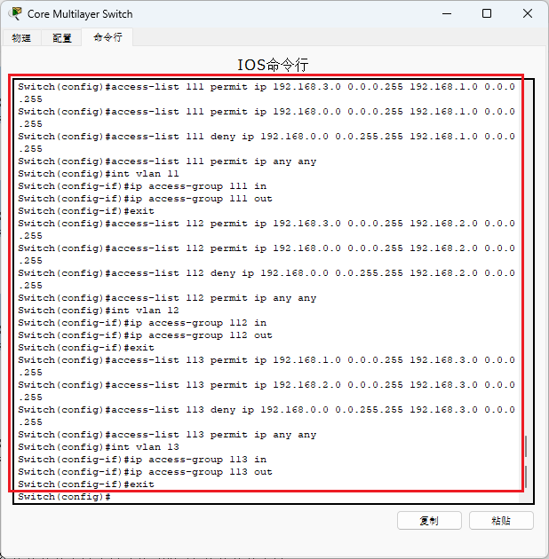

#### 4.1.3 DHCP配置

在核心层的DHCP服务器（School DHCP Server）中为每个VLAN配置DHCP池：


在核心交换机（School Core Domain Switch）将VLAN启用DHCP中继功能：
```
int vlan 11 //进入VLAN接口
ip helper-address 192.168.0.2 
exit
int vlan 12
ip helper-address 192.168.0.2
exit
int vlan 13
ip helper-address 192.168.0.2
exit
``` 
`ip helper-address`命令是用来指定一个UDP广播消息的转发目标。当交换机收到来自该VLAN内的UDP广播数据包时，它会将这些数据包转发到指定的ip helper-address。这在DHCP、TFTP、NTP等网络服务中非常有用，因为这些服务通常使用UDP广播进行通信。   
例如，对于vlan11，`ip helper-address 192.168.0.2`将为VLAN11配置ip helper-address，并将所有UDP广播消息转发到192.168.0.2，其他VLAN的配置与此类似。

配置好ip helper-address后，使用`ip routing`命令，启用核心交换机上的IP路由功能，这样交换机才能在不同的IP子网之间路由数据包。

开启不同工作室终端的DHCP服务（SSE-1 PC、SSE-2 PC、SSE-2 Laptop）  
以SSE-1 PC为例，在IP配置界面选择“自动获取”  
  
可以看到DHCP请求成功，为SSE-1 PC自动分配了IP地址，网关，子网掩码和DNS服务器

#### 4.1.4 软件学院服务器静态IP配置

服务器不会轻易改变，为其设置静态IP

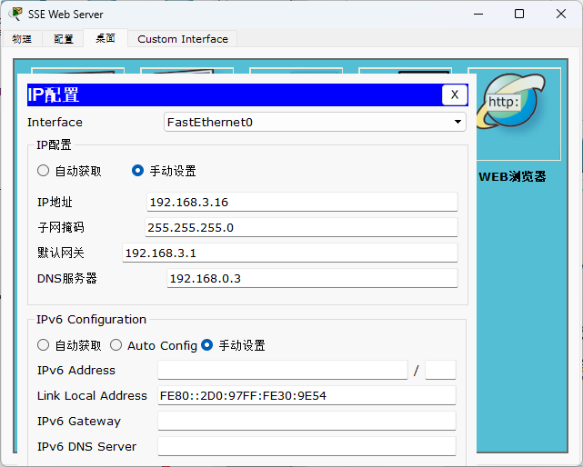


#### 4.1.5 WiFi配置

将软件学院办公室1的路由器（SSE-1 Router）的因特网配置为“自动获取”类型
  

配置路由器局域网  
  

路由器无线配置  
  

配置SSE PC、SSE Laptop、SSE Tablet PC、SSE Pda四个设备的无线网络（以SSE PC为例）


### 4.2 财务处（Treasury）网络配置

#### 4.2.1 VLAN配置
同上，将财务处交换机（Treasury Multilayer Switch）配置为VTP的client模式，使得财务处可以同步核心层的所由VLAN  
```
Switch(vlan)#vtp domain tongji
Switch(vlan)#vtp clent
```

Vlan21、Vlan22、Vlan23，分别对应财务处的三个虚拟局域网（Treasury Office1、Treasury Office2、Treasury Servers），并在核心交换机（Core Multilayer Switch）上为新建的3个VLAN配置IP地址 

配置信息如下：
  | VLAN编号 | VLAN名称 | 局域网 | 网段 | DNS |
  | :---: | :---: | :---: | :---: | :---: | 
  | 21 | treasury1 | 财务处办公室1 | 192.168.11.1 | 255.255.255.0 |
  | 22 | treasury2 | 财务处办公室2 | 192.168.12.1 | 255.255.255.0 |
  | 23 | treasury1-2 | 财务处服务器 | 192.168.13.1 | 255.255.255.0 |

配置网络交换机（Treasury Multilayer Switch）端口 
```
Switch(config)#interface FastEthernet0/1
Switch(config-if)#switchport trunk encapsulation dot1q
Switch(config-if)#switchport mode trunk
```
同上，将核心交换机到部门总交换机、部门总交换机到部门分交换机的接口设置为Trunk，将部门分交换机到终端的接口设置为Access，并选择对应VLAN

#### 4.2.2 ACL配置
同上，配置财务处的ACL 

针对服务器VLAN（VLAN23）：
* 允许同一部门内的VLAN（VLAN21和VLAN22）进行访问
* 拒绝其他部门VLAN对服务器VLAN的访问  

针对不同工作室：
* 允许部门服务器（VLAN23）访问
* 允许核心层服务器访问
* 拒绝其他部门VLAN访问
* 允许外部访问

在核心交换机配置如下：  
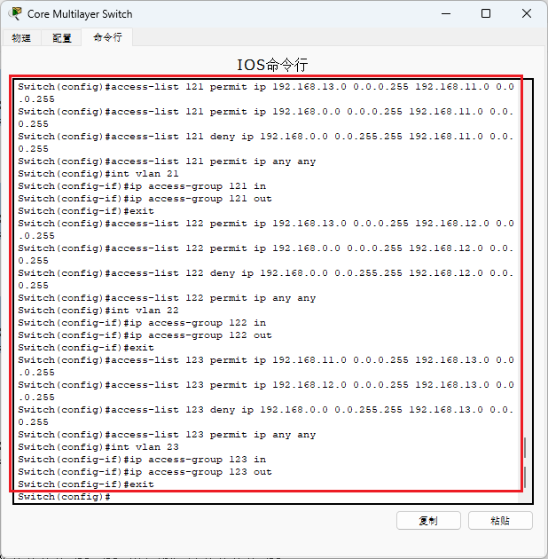

#### 4.2.3 DHCP配置
同上，在核心层的DHCP服务器（School DHCP Server）中为每个VLAN配置DHCP池  
然后在核心交换机（School Core Domain Switch）将VLAN启用DHCP中继功能：
```
int vlan 21
ip helper-address 192.168.0.2
exit
int vlan 22
ip helper-address 192.168.0.2
exit
int vlan 23
ip helper-address 192.168.0.2
exit
```

开启不同工作室终端的DHCP服务（Treasury-1 PC、Treasury-2 PC、Treasury-2 Laptop）  

以Treasury-2 PC为例，DHCP请求成功，自动分配了IP地址，网关，子网掩码和DNS服务器


#### 4.2.4 财务处服务器静态IP配置

为财务处服务器配置静态IP：


#### 4.2.5 WiFi配置

同上，将财务处办公室1的路由器（SSE-1 Router）的因特网配置为“自动获取”类型 

配置路由器局域网  
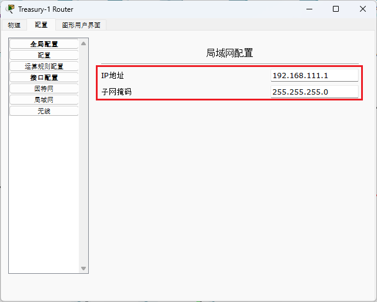  

路由器无线配置  
  

配置Treasury PC、Treasury Laptop、Treasury Tablet PC、Treasury Pda四个设备的无线网络（以Treasury Laptop为例）  


### 4.3 行政管理部门（Admin）网络配置

#### 4.3.1 VLAN配置
同上，将行政管理部门交换机（Admin Multilayer Switch）配置为VTP的client模式，使得行政管理部门可以同步核心层的所由VLAN
```
Switch(vlan)#vtp domain tongji
Switch(vlan)#vtp clent
```

Vlan31、Vlan32、Vlan33，分别对应行政管理部门的三个虚拟局域网（Admin Office1、Admin Office2、Admin Servers），并在核心交换机（School Core Domain SwitchCore Multilayer Switch）上为新建的3个VLAN配置IP地址  
配置信息如下：
  | VLAN编号 | VLAN名称 | 局域网 | 网段 | DNS |
  | :---: | :---: | :---: | :---: | :---: | 
  | 31 | admin1 | 行政管理部办公室1 | 192.168.21.1 | 255.255.255.0 |
  | 32 | admin2 | 行政管理部办公室2 | 192.168.22.1 | 255.255.255.0 |
  | 33 | admin1-2 | 行政管理部服务器 | 192.168.23.1 | 255.255.255.0 |

配置网络交换机（Admin Multilayer Switch）端口
```
Switch(config)#interface FastEthernet0/1
Switch(config-if)#switchport trunk encapsulation dot1q
Switch(config-if)#switchport mode trunk
```

同上，将核心交换机到部门总交换机、部门总交换机到部门分交换机的接口设置为Trunk，将部门分交换机到终端的接口设置为Access，并选择对应VLAN

至此，各部门VLAN配置完成，可以通过命令`show ip interface brief`查看核心交换机所有接口的IP配置的摘要信息

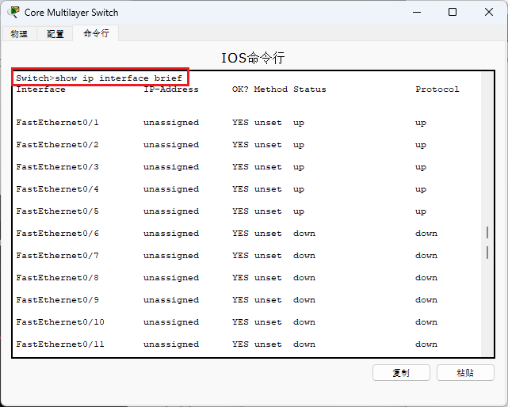
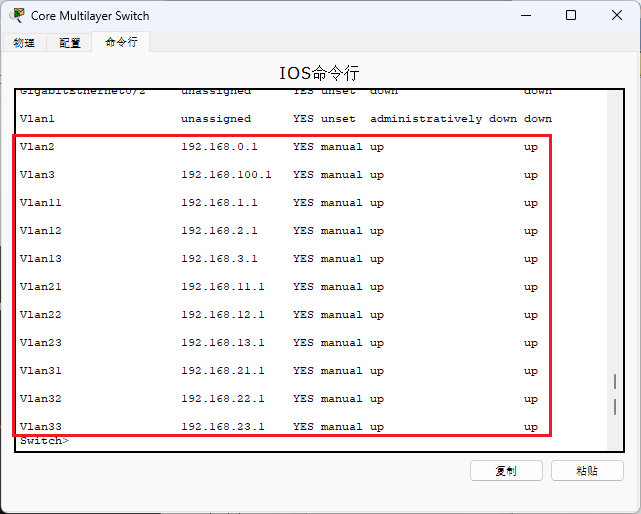

#### 4.3.2 ACL配置
同上，配置行政管理部门的ACL 

针对服务器VLAN（VLAN33）：
* 允许同一部门内的VLAN（VLAN31和VLAN32）进行访问
* 拒绝其他部门VLAN对服务器VLAN的访问  

针对不同工作室：
* 允许部门服务器（VLAN33）访问
* 允许核心层服务器访问
* 拒绝其他部门VLAN访问
* 允许外部访问

在核心交换机配置如下：   


至此，各部门ACL配置完成，可以通过命令`show access-lists`在核心交换机查看所有ACL配置信息，如下所示：  


#### 4.3.3 DHCP配置
同上，在核心层的DHCP服务器（School DHCP Server）中为每个VLAN配置DHCP池  
然后在核心交换机（School Core Domain Switch）将VLAN启用DHCP中继功能：
```
int vlan 31
ip helper-address 192.168.0.2
exit
int vlan 32
ip helper-address 192.168.0.2
exit
int vlan 33
ip helper-address 192.168.0.2
exit
```
开启不同工作室终端的DHCP服务（Admin-1 PC、Admin-2 PC、Admin-2 Laptop）

以Admin-2 Laptop为例，DHCP请求成功，自动分配了IP地址，网关，子网掩码和DNS服务器
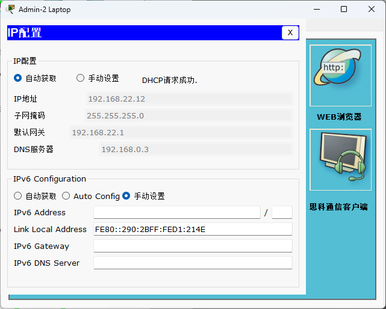

#### 4.3.4 行政管理部门服务器静态IP配置

为行政管理部门服务器配置静态IP：


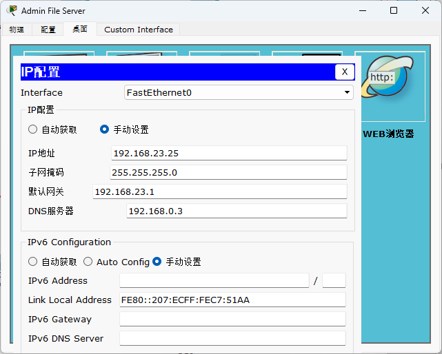

#### 4.3.5 WiFi配置

同上，将行政管理部门办公室1的路由器（Admin-1 Router）的因特网配置为“自动获取”类型  

配置路由器局域网  
  

路由器无线配置  
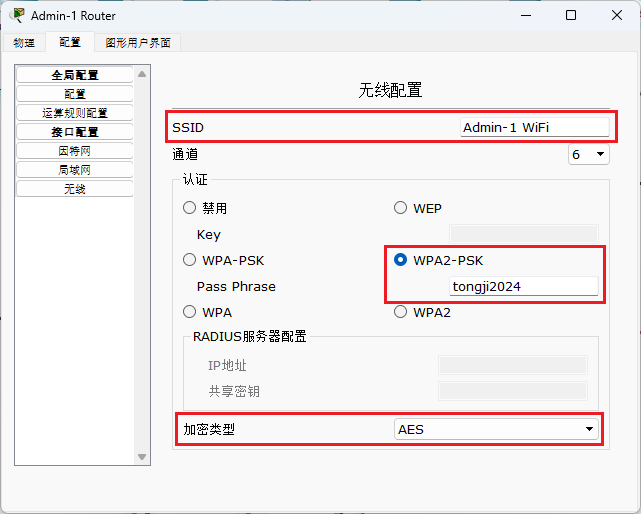   

配置Admin PC、Admin Laptop、Admin Tablet PC、Admin Pda四个设备的无线网络（以Admin Pda为例）
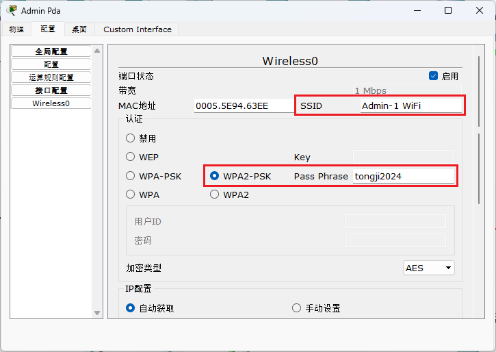


## 5 Web 服务配置
### 5.1 核心层 Web 服务配置
#### 5.1.1 服务器配置
为学校内部总网配置Web服务器，分配静态IP：

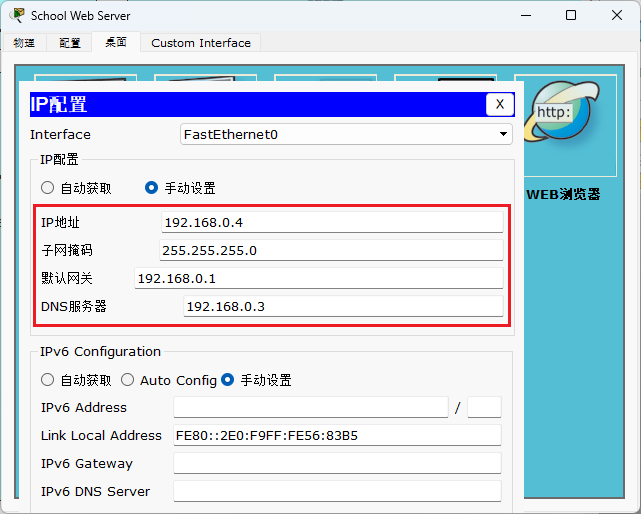

选择 配置-HTTP ，将HTTP和HTTPS设为启用，并修改index.html中的主页内容：

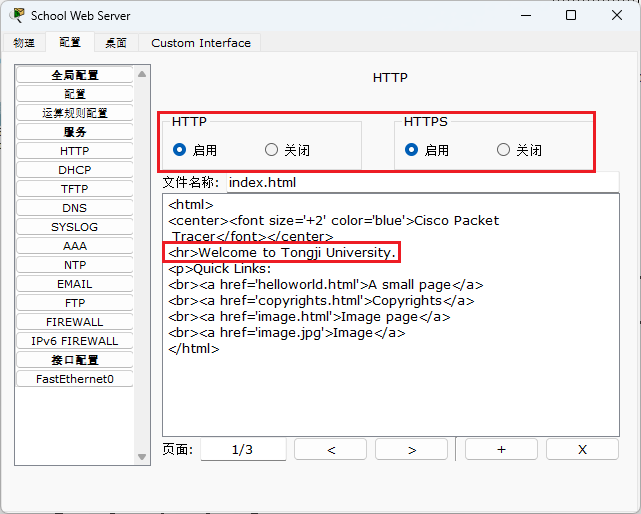

同理，为学校外网配置Web服务器，分配静态IP。选择 配置-HTTP，将HTTP和HTTPS设为启用，并修改index.html中的主页内容。
#### 5.1.2 DNS 记录设置
在内网DNS服务器上，为Web服务器配置内部各部门的IP与域名映射。


在外网DNS服务器上，将Web服务器的公网IP与学校域名绑定，确保外网可访问。

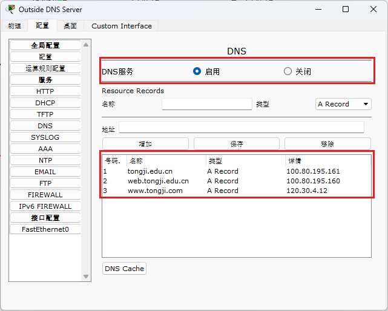 
### 5.2 部门内部 Web 服务配置
#### 5.2.1 服务器配置
为SSE部门配置Web服务器，分配静态IP：


选择 配置-HTTP ，将HTTP和HTTPS设为启用，并修改index.html中的主页内容：


同理，完成Treasury部门、Admin部门Web服务器的配置。

#### 5.2.2 访问控制

由于不开放给公网，这些部门都无需在外网DNS服务器上记录域名和IP。通过先前的ACL配置可以限制外部访问，确保部门Web服务仅供内部使用。

## 6 Email 服务配置 
### 6.1 核心层 Email 服务配置
#### 6.1.1 服务器配置
为学校内部总网配置 Email 服务器，分配静态IP：

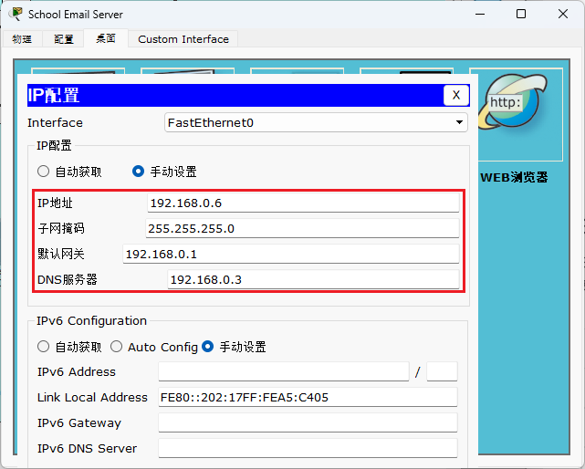

选择 服务-EMAIL，开启SMTP和POP3，配置需要的邮箱用户的用户名及密码：

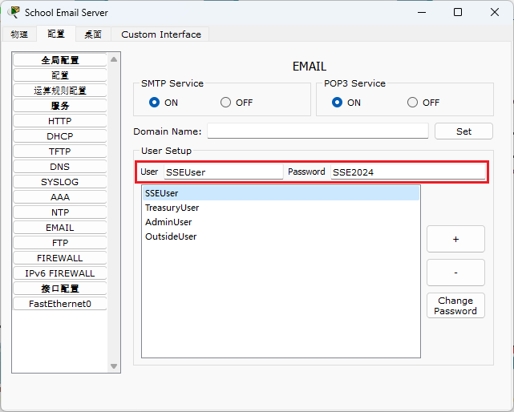

根据学校各部门的需求，创建了多个邮箱账户，每个账户均设置了唯一的用户名及安全密码。如上述步骤所示，同理，配置其他邮箱用户的用户名及密码。
#### 6.1.2 DNS 记录设置
在学校的内部DNS服务器中，为邮件服务器的内部IP地址创建A记录，确保校园网内用户可以通过域名访问邮件服务。


在外部DNS服务器上，需映射该邮件服务器的公网IP地址至先前设定的域名，同时确保域名与邮件服务器配置的域名完全一致，以便全球互联网用户通过域名访问邮件服务，实现内外网邮件服务的无缝对接。


### 6.2 客户端配置
进⼊SSE-1 PC的桌面-邮件配置，从上到下依次输入：
* 你的名字 ：
    输入与用户名一致的显示名称。
* 邮箱地址：
    邮箱地址遵循标准格式，即“用户名@自定义域名”，确保邮件系统内外部的一致性和辨识度。
* 服务器信息：
    分为接入邮件服务器和发送邮件服务器。邮件客户端配置时，如果内部DNS已正确配置，则两个邮件服务器地址可直接使用设定的域名；反之，则需手动输入邮件服务器的内部IP地址作为邮件客户端服务器地址和转发邮件服务器地址。
* 登录凭据：
    用户需输入与邮件服务器配置相匹配的用户名与密码，以完成身份验证，确保邮件服务的顺利接入。
    
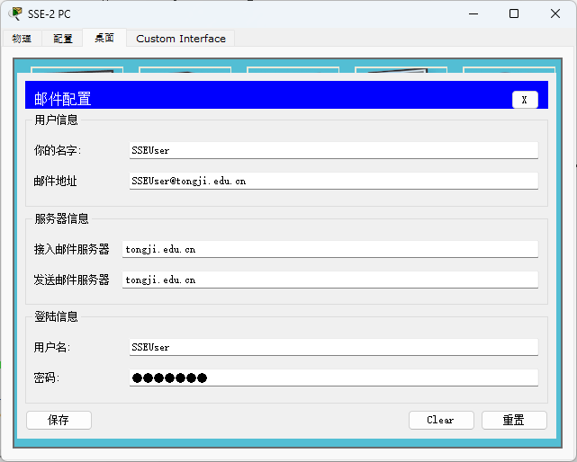

点击保存完成此客户端配置，即可进行邮件操作。同理，进入各客户端终端进行配置。

## 7 FTP 服务配置 
### 7.1 核心层 FTP 服务配置
在核心层的File服务器管理界面中，选择配置-FTP选项，以启动FTP服务，确保服务器能够响应FTP客户端的连接请求。
同时，创建需要的用户名和密码，勾选所有权限，点击增加。这些权限细致地控制了用户对服务器上文件和目录的读、写、删除等操作。

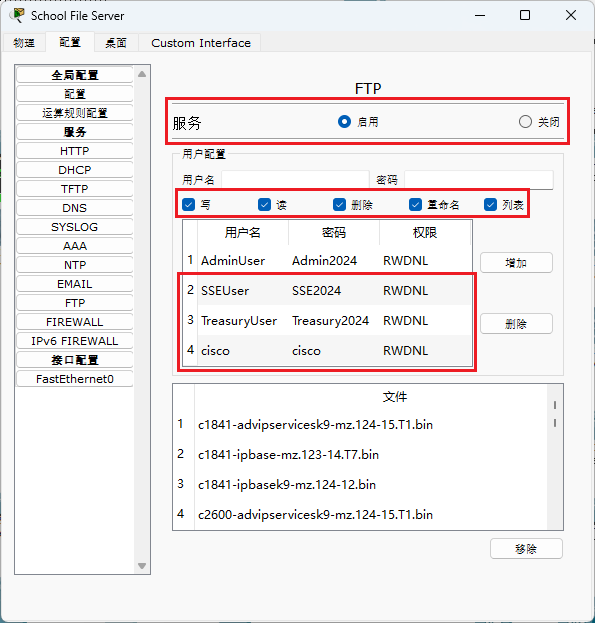

为确保安全性，我们为不同用户群体创建了多个账户，并分配了相应的用户名、密码，确保了数据的访问符合学校的安全策略与管理要求。
### 7.2 部门内部 FTP 服务配置
在SSE的File服务器管理界面中，选择配置-FTP选项，以启动FTP服务，确保服务器能够响应FTP客户端的连接请求。
同时，创建SSE的用户名和密码，勾选所有权限，点击增加。这些权限细致地控制了用户对服务器上文件和目录的读、写、删除等操作。


同理，完成Treasury部门、Admin部门FTP服务器的配置。

由于不开放给公网，这些部门都无需在外网DNS服务器上记录域名和IP。

### 7.3 客户端访问
鉴于多数高校学院习惯于直接使用IP地址访问文件服务器，我们未在本次配置中集成域名系统。用户只需在本地客户端的命令行界面执行`ftp [服务器IP地址]`命令，随后输入预先配置的用户名和密码，即可开始文件传输操作。

## 8 VOIP 服务配置

### 8.1 配置原理

VOIP（Voice over Internet Protocol）服务，也称为IP电话或网络电话服务，是一种通过互联网传输声音的技术，而不是传统的电话线路。用户可以通过VOIP服务，将模拟语音信号转换为数字信号，通过互联网发送到任何地方，实现远距离通信。这种技术可以使用宽带互联网连接，使得通话成本较传统电话系统大大降低，尤其是在国际通话中。

VOIP服务具有以下几个主要特点：

1. 成本效益：使用互联网进行通话，通常费用低于传统电话服务。
2. 多功能性：除了语音通话外，许多VOIP服务还提供视频通话、短信、会议调用等额外功能。
3. 灵活性：用户可以在多种设备上使用VOIP服务，包括电脑、智能手机、VOIP电话机等。
4. 可扩展性：适合企业使用，可以根据需要轻松添加额外的通话线路或服务。

VOIP技术的实现通常依赖于一些协议，如SIP（会话初始协议）和RTP（实时传输协议），它们帮助在网络中建立和管理语音通信。

### 8.2 具体配置

1. 据设计，各部门电话不接入内网，直接由Hallway Router提供。通过设置FastEthernet和Serial接口的IP地址和子网掩码，使得设备可以在网络中进行通信。

    
    

2. 通过创建一个DHCP池，为VOIP设备分配IP地址，子网掩码以及默认网关。这样的配置确保了VOIP设备能够自动获得网络配置参数，简化了网络管理。（DHCP池名字一定要叫VOICE，标明这是提供VOIP服务的DHCP，否则VOIP服务不生效）

    

3. 设置VoIP服务参数：

    - Telephony-service: 启动路由器上的VoIP服务，并配置最大的目录号码（DN）和电话数目。
    - IP Source-address: 指定VoIP服务使用的源IP地址，确保VoIP流量可以正确路由。
    - Max-ephones 和 Max-dn: 设定最大的IP电话数量和目录号码的数量。
    - Auto assign: 自动分配目录号码给IP电话。Treasury、Admin、SSE分别进行分配。

    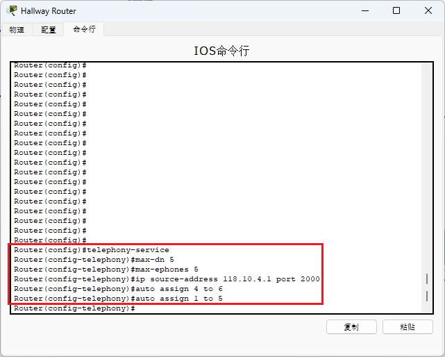
    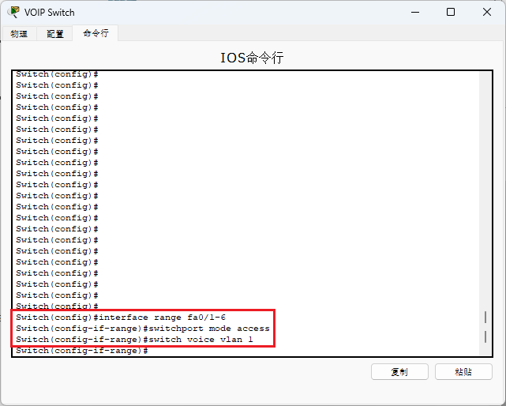
    
    
    

4. 光标移动到电话上，若看到分配到的电话号码证明配置成功：

    
    
    

## 9 内网外网连通配置

### 9.1 配置原理

1. Hallway Router（走廊路由器）：位于内网核心的路由器，通常负责处理内网各个终端设备的数据请求，并将其导向正确的目的地，无论是内网中的其他设备还是外网的服务器。它负责在内部网络之间进行路由选择，确保数据包能够高效传输。

2. Outside Router（外部路由器）：连接到互联网服务提供商（ISP）的路由器，作为内网与外网之间的桥梁。它处理从内网出去的所有数据包，并从外网接收数据包。通常，这个路由器配置有公网IP地址，并执行NAT操作。

3. 终端IP地址配置：内网中每个设备（如计算机、打印机等）都需要有一个唯一的IP地址以进行通信。在大多数内网环境中，这些IP地址是私有的，通过DHCP（动态主机配置协议）自动分配，确保设备能够无缝接入网络并与其他设备通信。

4. 交换机配置：交换机负责在网络中的设备之间有效地传递信息。它通过检查数据包中的MAC地址，将数据直接从一个端口转发到另一个端口，这样可以减少网络拥堵，提高传输效率。交换机在物理层和数据链路层操作，是网络的基础组件。

5. NAT配置：网络地址转换（NAT）是一种关键技术，用于将内网中的私有IP地址转换为外网可识别的公网IP地址。这不仅允许内网设备访问互联网，还帮助隐藏内网的结构，增强网络安全。在外部路由器上进行配置，每当内网设备尝试与外网通信时，NAT会将其源IP地址替换为路由器的公网IP地址。

6. 静态路由配置：静态路由是网络管理员手动设置的路由，它定义了网络数据包的具体传输路径。这对于小型网络来说是一种有效的路由管理方式，可以确保数据沿预定路径传输，提高网络的可预测性和稳定性。在Hallway Router和Outside Router上设置静态路由可以指定数据流向，尤其是在复杂的网络环境中保持效率和安全性。

### 9.2 具体配置

#### 9.2.1 外网部分拓扑图

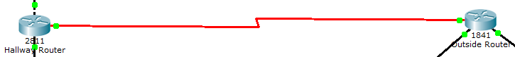


#### 9.2.2 相关设备信息

 | 端口 | IP | 子网掩码 |
  | :---: | :---: | :---: |
  | Outside Router FastEthernet 0/0 | 120.30.3.254 | 255.255.255.0 |
  | Outside Router FastEthernet 0/1 | 120.30.4.254 | 255.255.255.0 |
  | Outside Router Serial 0/1/0 | 202.120.17.29 | 255.255.255.0 |
  | Hallway Router FastEthernet 0/0 | 192.168.100.2 | 255.255.255.0 |
  | Hallway Router Serial 0/1/0 | 202.120.17.18 | 255.255.255.0 |

TODO

  | 终端 | IP | 子网掩码 | 网关 | DNS |
  | :---: | :---: | :---: | :---: | :---: |
  | Outside PC1 | 120.30.3.11 | 255.255.255.0 | 120.30.3.254 | 120.30.4.11 |
  | Outside PC2 | 120.30.3.12 | 255.255.255.0 | 120.30.3.254 | 120.30.4.11 |
  | Outside DNS Server | 120.30.4.11 | 255.255.255.0 | 120.30.4.254 | 120.30.4.11 |
  | Outside Web Server | 120.30.4.12 | 255.255.255.0 | 120.30.4.254 | 120.30.4.11 |

#### 9.2.3 VLAN配置

在网络中，VLAN (虚拟局域网络) 允许在同一物理网络上创建多个逻辑子网，从而有效地隔离网络流量。Trunk端口是用于在交换机之间传输多个VLAN的流量的端口。通过Trunk端口，可以将来自不同VLAN的数据都通过同一个物理连接传输。

将多个端口被设置为Trunk模式，并且允许所有VLAN（1-1005）的流量通过。这些端口可以接收和发送属于任何这些VLAN的数据。


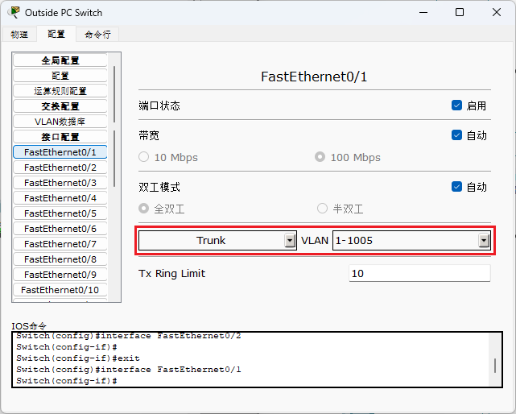


为了使不同VLAN之间可以通信，需要在路由器上进行相应的路由配置，使得不同VLAN的流量可以被正确路由到目的地。

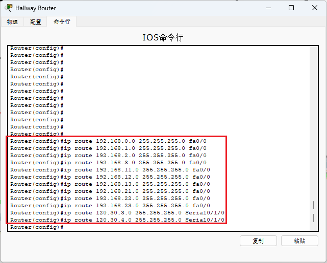

#### 9.2.4 NAT配置

NAT配置的目的是允许网络内部的私有IP地址通过单个或少数几个公共IP地址访问外部网络。

1. 定义NAT内部和外部接口
2. 配置静态NAT
3. 配置NAT地址池
4. 定义访问列表
5. 将访问列表与NAT池关联

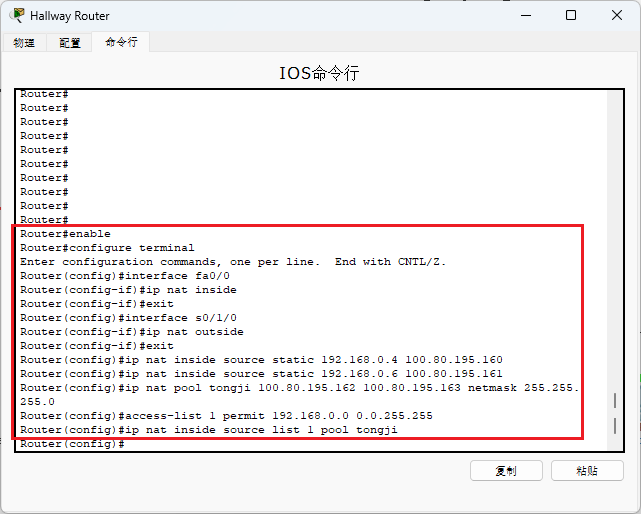

#### 9.2.5 静态路由配置

1. **路由器配置**：在“Hallway Router”上，静态路由配置指令是用来确保网络流量能从一个接口传输到另一个特定的接口。另外，还配置了指向 `100.80.195.0/24` 和 `120.30.0.0/16` 网段的路由，这些是通过序列接口发送，常用于连接不同网络或广域网连接。
Hallway Router、Outside Router、终端IP地址配置、交换机配置、NAT配置、静态路由配置

    
    
    
    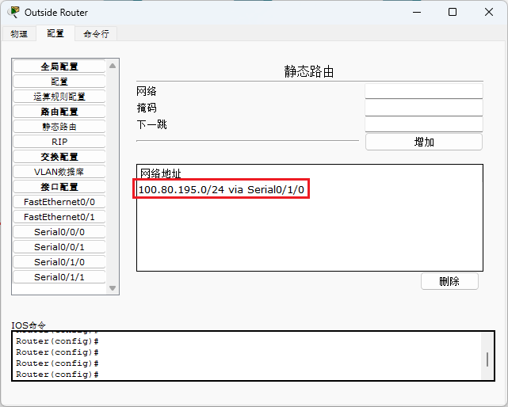

2. **交换机配置**：在“Core Multilayer Switch”上的配置显示了两条路由，这些路由指定了 VLAN3 作为出口。这说明 VLAN3 被配置为可以访问 120.30.0.0/24 和 120.30.4.0/24 网络。通过 VLAN 实现这种路由是一种划分不同网络流量的常见方法，确保数据安全性和网络管理的灵活性。

    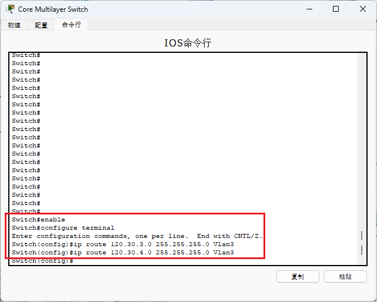
    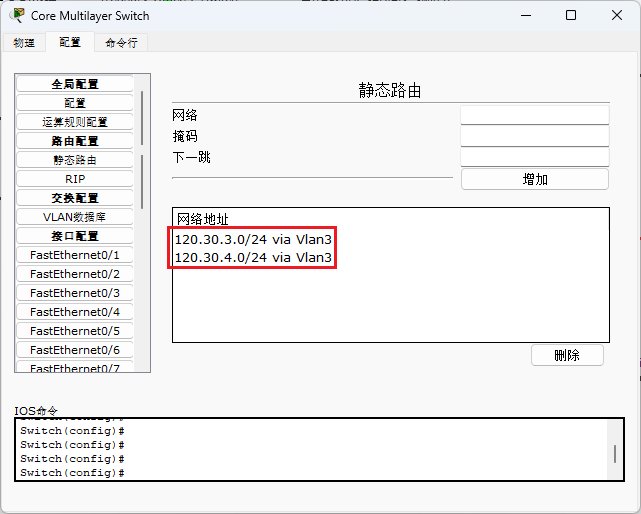

#### 9.2.6 网络配置

1. 局域网（LAN）配置：

  - IP配置：SSE、Treasury和Admin的路由器为局域网内的设备提供了IP地址（例如：192.168.1.1, 192.168.110.1）。这些IP地址属于私有地址范围，通常用于内部网络。

  - 子网掩码：通常配置为255.255.255.0，这表示网络地址和主机地址的分割。在此配置中，网络部分是192.168.x，主机部分是最后一位，允许网络中存在254个设备。

    
    
    

2. 因特网（Internet）连接：

  - 默认网关：路由器会被配置为网络的默认网关，如IP地址192.168.1.1或192.168.11.1，它是局域网内设备访问因特网的出口点。

  - DNS服务器：DNS地址（如192.168.0.3）用于域名解析，它是网络上设备解析网络地址（例如将www.google.com转换为IP地址）的服务。

    
    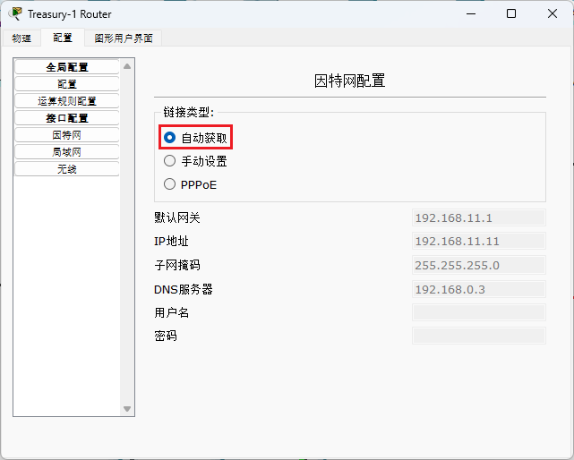
    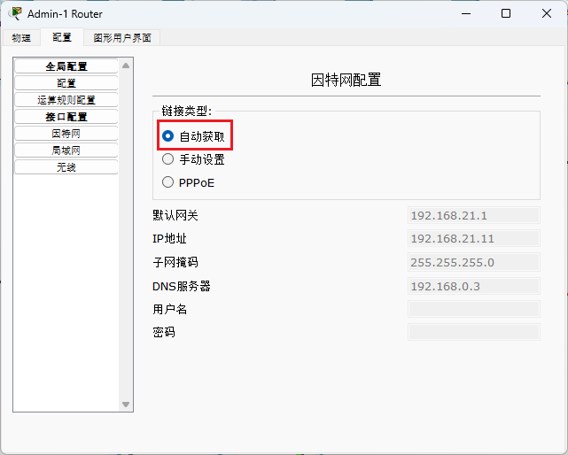

3. 无线网络配置：

  - SSID与安全：无线网络通过SSID（例如SSE-1 WiFi, Treasury-1 WiFi）标识自己，并使用WPA2-PSK（预共享密钥）加密方式保护网络安全。使用AES加密标准可以保护数据传输过程中的隐私和完整性。

  - 密钥：WPA2网络安全密钥（如tongji2024）被用于验证连接到网络的设备和加密网络通信。

    
    
    
    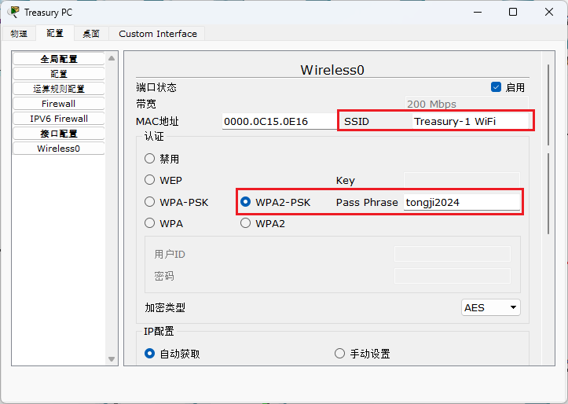
    
    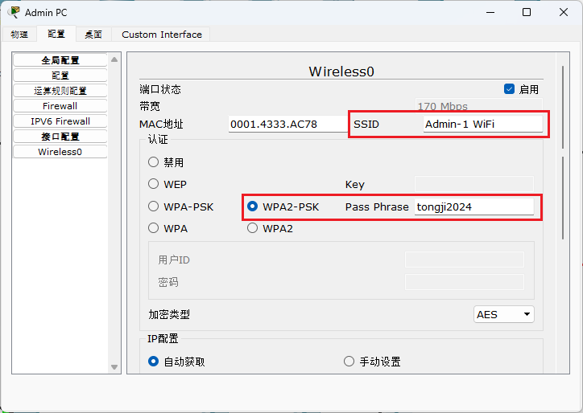

## 10 网络测试


## 11 数据包分析解读

### 11.1 MAC数据包分析解读

MAC地址：  
MAC地址也叫物理地址、硬件地址，全称为媒体访问控制地址（Media Access Control address），
是网络设备在制造过程中固化在网络接口卡（Network Interface Card, NIC）的唯一标识符。  
MAC地址的长度为48位(6个字节)，通常表示为12个16进制数，如：00-16-EA-AE-3C-40就是一个MAC地址，其中前3个字节，0x00-16-EA代表网络硬件制造商的编号，它由IEEE(电气与电子工程师协会)分配，后3个字节，0xAE-3C-40代表该制造商所制造的某个网络产品(如网卡)的系列号。

MAC报文格式： 
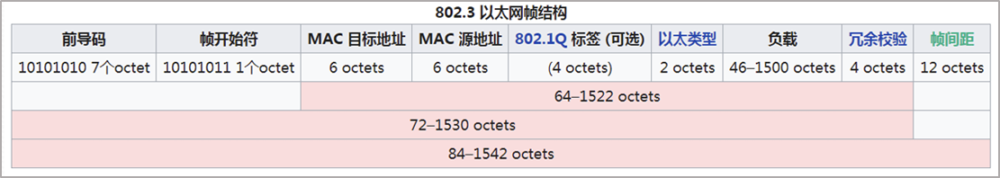
* Ethernet II 帧格式：
  * 前导码和帧开始符：通常帧的开始有一个特定的前导码和帧开始符，用来标示帧的起始点。
  * 目标MAC地址和源MAC地址：每个Ethernet II帧都包含6字节的目标 MAC 地址和6字节的源MAC地址，分别指定帧的接收者和发送者。
  * 类型字段：紧随MAC地址后的是两字节的类型字段，用于指定帧中承载的数据类型。例如，0x0800 代表 IPv4 数据，0x0806 代表 ARP 请求，0x86DD 代表IPv6 数据。
* 长度与类型字段的区分： 
  * 在早期的以太网版本中，这个字段被用来表示数据的长度，但在 Ethernet II 标准中，它被用作类型字段。 
  * 如果该字段的值大于或等于1536（0x0600），则解释为类型字段，表明帧是一个Ethernet II 帧。 
  * 如果该字段的值在46到1500字节之间（不包括1500～1536 的未定义区域），则表示帧长度，并且帧遵循IEEE 802.3标准。 
* 数据和帧校验序列：类型字段后是数据负载，长度可变。每个帧的末尾包括一个32位的循环冗余校验码（CRC），用于检测传输过程中的错误。

在simulation模式下，打开 Outside PC1 的命令提示符，执行`ping web.tongji.edu.cn`，如下所示：
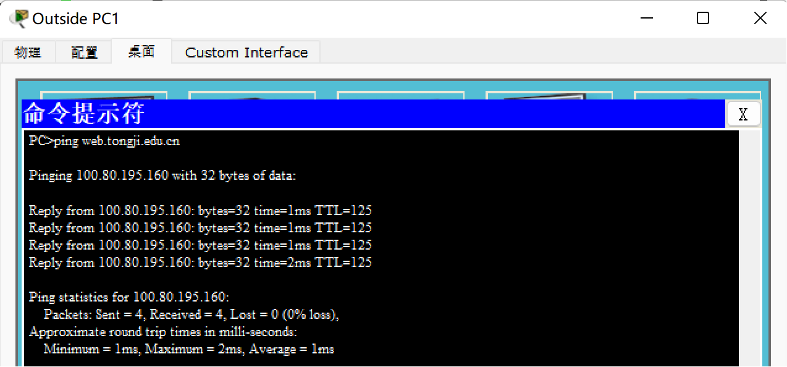  

抓取ICMP数据包  
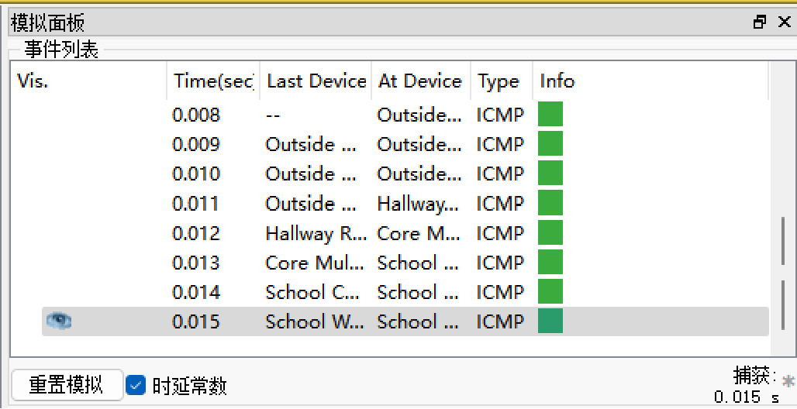  

分析报文  

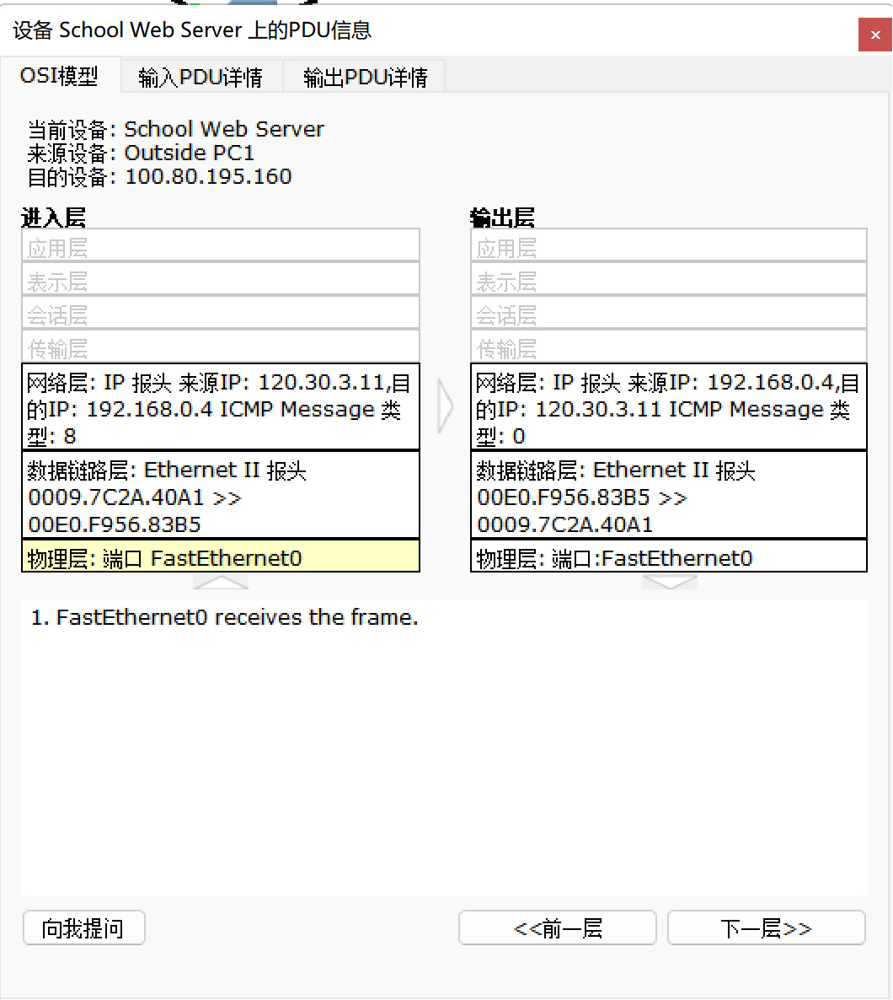  
这张图是反映了ICMP数据包在网络中的移动，从它进入路由器（入站PDU细节），到它从路由器出去（出站PDU细节）。

入站PDU细节： 
* 在设备：School Web Server
* 源地址（Source）：Outside PC1
* 目的地址（Destination）：100.80.195.160

* 网络层：IP报头显示源IP为120.30.3.11，目的IP为192.168.0.4，ICMP消息类型为8（回显请求）。
* 数据链路层：Ethernet II报头展示源MAC地址为00E0.F956.83B5，目的MAC地址为0009.7C2A.40A1。
* 物理层：表明该数据包是通过端口FastEthernet0进入路由器的。

出站PDU细节：
* 网络层：IP报头信息不变，仍然显示源IP为120.30.3.11和目的IP为192.168.0.4，ICMP消息类型仍为8。
* 数据链路层：Ethernet II报头此时展示的源MAC地址变为路由器的源MAC地址0009.7C2A.40A1，而目的MAC地址变为另一个MAC地址（可能是下一个跳转目标的MAC地址）00E0.F956.83B5。
* 物理层：数据包现在是通过端口FastEthernet0离开路由器的。

这个数据包是从Outside PC1发往100.80.195.160的ICMP Echo Request（回显请求），经过School Web Server路由器进行转发，将源MAC地址和目的MAC地址进行了转换，并且通过FastEthernet0接口发出。  

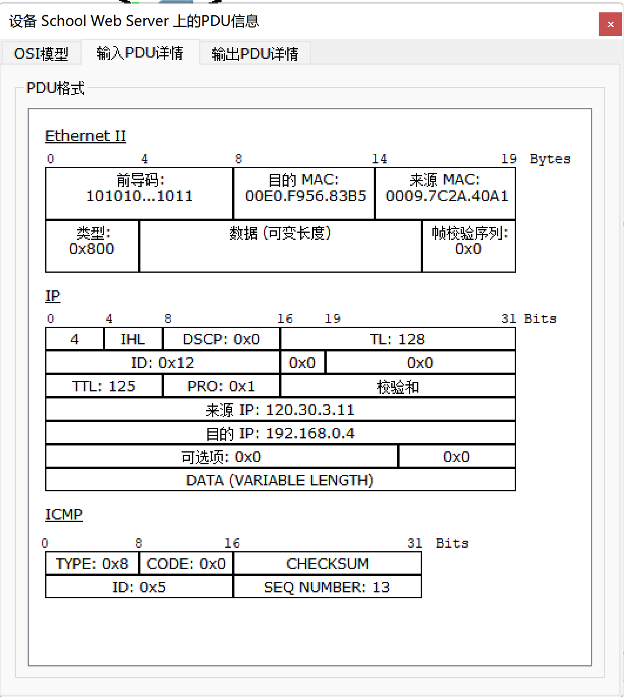  
图中显示了输入PDU的详细信息

在Ethernet II部分：
* 前导码是101010...1011，表示这是一个以太网帧。
* 目标MAC地址是00E0.F956.83B5，这是接收方的硬件地址。
* 来源MAC地址是0009.7C2A.40A1，这是发送方的硬件地址。
* Type字段值为0x800，表示这是一个IPv4数据包。

在IP部分：
* 版本（Version）字段值为4，表示这是IPv4。
* 头部长度（IHL）字段值为4，表示头部有4个32位字长。
* 服务类型（TOS）字段值为0x0，表示优先级为0，延迟敏感度为0，可靠性要求为0，吞吐量需求为0。
* 总长度（Total Length）字段值为128，表示整个IP数据包的长度。
* 标识符（ID）字段值为0x12，用来唯一标识每一个数据包。
* 生存时间（TTL）字段值为125，表示该数据包最多可以经过125台路由器转发。
* 协议（Protocol）字段值为1，表示上层协议是ICMP。
* 首部校验和（Header Checksum）字段值为0x0，用于验证IP头部是否正确。
* 源IP地址是120.30.3.11，目标IP地址是192.168.0.4。
* 可选项（Options）字段值为0x0，表示没有可选字段。
* DATA (VARIABLE LENGTH)表示数据部分的长度是可变的。

在ICMP部分：
* TYPE字段值为0x8，表示这是一个Echo Request（回声请求），即ping请求。
* CODE字段值为0x0，表示没有附加代码。
* CHECKSUM字段值未知，用于检查数据完整性。
* ID字段值为0x5，用于匹配请求和响应。
* SEQ NUMBER字段值为13，表示序列号。

这个ICMP数据报是一份ping请求，由源主机120.30.3.11向目标主机192.168.0.4发送，请求对方回应。如果目标主机收到此请求并成功处理，则会返回一份ping响应给源主机。

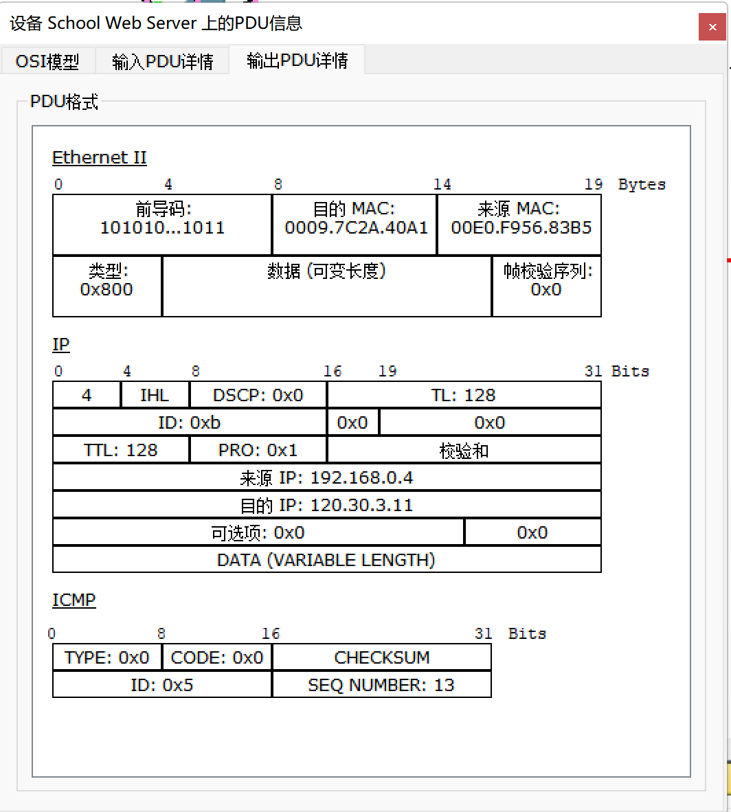  
图中显示了输出PDU的详细信息

在Ethernet II部分：
* 前导码是101010...1011，表示这是一个以太网帧。
* 目标MAC地址是0009.7C2A.40A1，这是接收方的硬件地址。
* 来源MAC地址是00E0.F956.83B5，这是发送方的硬件地址。
* Type字段值为0x800，表示这是一个IPv4数据包。

在IP部分：
* 版本（Version）字段值为4，表示这是IPv4。
* 头部长度（IHL）字段值为4，表示头部有4个32位字长。
* 服务类型（TOS）字段值为0x0，表示优先级为0，延迟敏感度为0，可靠性要求为0，吞吐量需求为0。
* 总长度（Total Length）字段值为128，表示整个IP数据包的长度。
* 标识符（ID）字段值为0xb，用来唯一标识每一个数据包。
* 生存时间（TTL）字段值为128，表示该数据包最多可以经过128台路由器转发。
* 协议（Protocol）字段值为1，表示上层协议是ICMP。
* 首部校验和（Header Checksum）字段值为0x0，用于验证IP头部是否正确。
* 源IP地址是192.168.0.4，目标IP地址是120.30.3.11。
* 可选项（Options）字段值为0x0，表示没有可选字段。
* DATA (VARIABLE LENGTH)表示数据部分的长度是可变的。

在ICMP部分：
* TYPE字段值为0x0，表示这是一个Echo Reply（回声应答），即ping响应。
* CODE字段值为0x0，表示没有附加代码。
* CHECKSUM字段值未知，用于检查数据完整性。
* ID字段值为0x5，与请求时相同，用于匹配请求和响应。
* SEQ NUMBER字段值为13，与请求时相同，表示序列号。  

这个数据报是一份ping响应，由目标主机192.168.0.4向源主机120.30.3.11发送，作为对之前ping请求的回复。

### 11.2 ARP数据包分析解读

ARP协议（地址解析协议）用于将网络层的IP地址解析为数据链路层的MAC地址，以保证通信的顺利进行。  

ARP工作原理：  
* ARP请求：  
  当一台主机想要发送数据给另一台主机时，它首先广播一个ARP请求，包含自身的MAC和IP地址以及目标设备的IP地址。由于此时不确定目标MAC地址，查询分组会在网络层中广播。 
* ARP响应：  
  局域网内的所有主机接收并处理这个ARP请求。如果某台主机的IP地址与请求中目标IP地址匹配，它会返回一个ARP响应，包含自身的MAC地址，以单播方式发送给请求主机。 

ARP报文格式：   
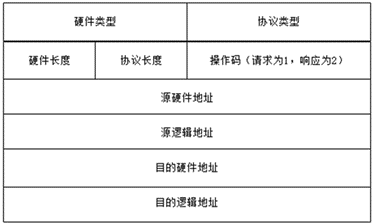
* 硬件类型：16位字段，用来定义运行ARP的网络类型。每个局域网基于其类型被指派一个整数。例如：以太网的类型为1。ARP可用在任何物理网络上。 
* 协议类型：16位字段，用来定义使用的协议。例如：对IPv4协议这个字段是0800。ARP可用于任何高层协议。
* 硬件长度：8位字段，物理地址的长度，以字节为单位。例如：以太网为6。
* 协议长度：8位字段，逻辑地址的长度，以字节为单位。例如：IPv4为4。 
* 操作码：16位字段，用来定义报文的类型，已定义的分组类型有两种：ARP请求、ARP响应。 
* 源硬件地址：这是一个可变长度字段，用来定义发送方的物理地址。例如：对于以太网这个字段的长度是6字节。
* 源逻辑地址：这是一个可变长度字段，用来定义发送方的逻辑（IP）地址。例如：对于IP 协议这个字段的长度是4字节。 
* 目的硬件地址：这是一个可变长度字段，用来定义目标的物理地址，例如，对以太网来说这个字段位6字节。对于ARP请求报文，这个字段为全0，因为发送方并不知道目标的硬件地址。 
* 目的逻辑地址：这是一个可变长度字段，用来定义目标的逻辑（IP）地址，对于IPv4协议这个字段的长度为4个字节。

在simulation模式下，打开SSE-2 Laptop的命令提示符，执行`ping 192.168.1.11`（ping SSE-1 PC），如下所示：
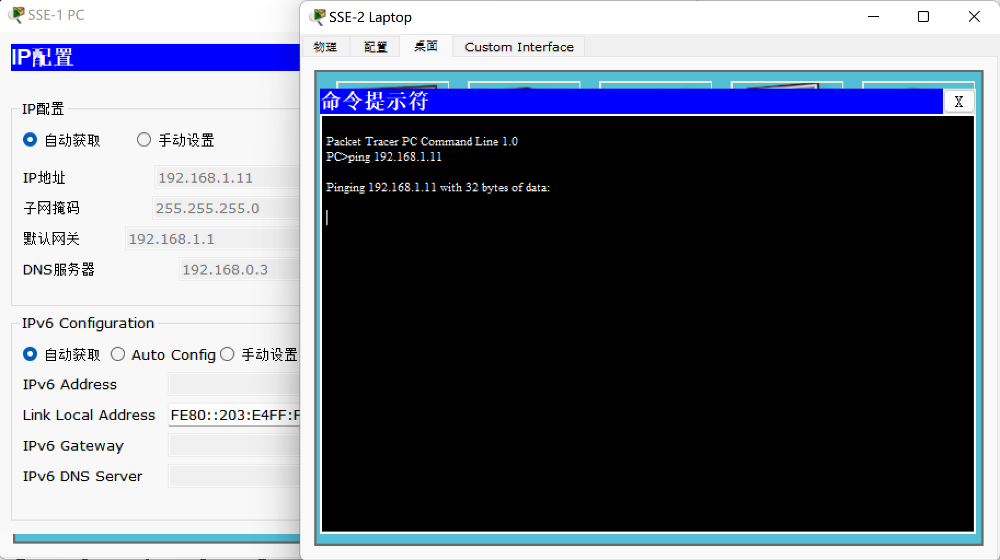

抓取ARP数据包
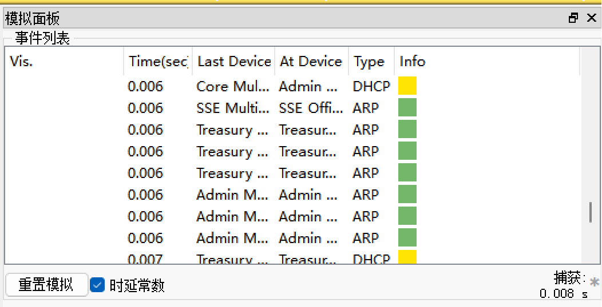

分析报文  

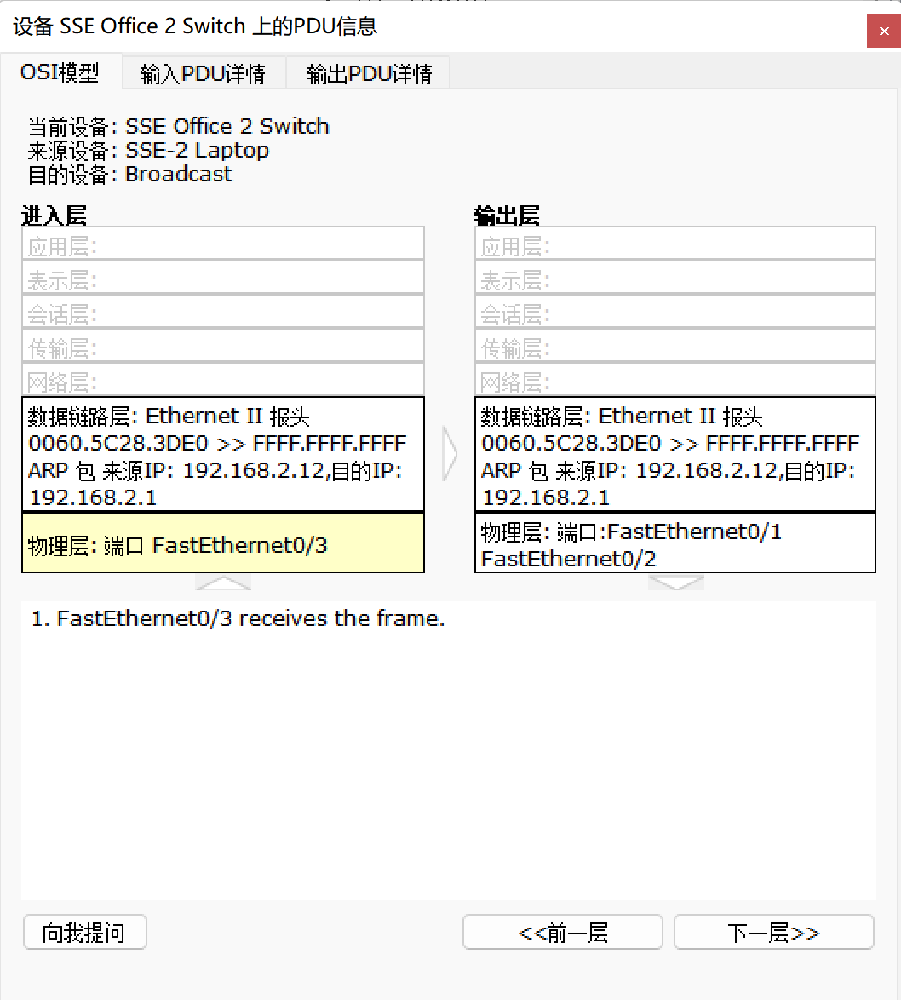 
* 当前设备：SSE Office 2 Switch，表示此信息来源于SSE Office 2 Switch设备
* 来源设备：SSE-2 Laptop，表示数据包来自于SSE-2 Laptop
* 目的设备：Broadcast，表明这是一个广播包，目标为所有设备
* 进入层（输入PDU）：
  * 数据链路层：展示了Ethernet II帧头信息。源MAC地址为0060.5C28.3DE0，目标MAC地址为广播地址FFFF.FFFF.FFFF。ARP请求包的源IP为192.168.2.12，目标IP为192.168.2.1
  * 物理层：指出数据包通过SSE Office 2 Switch的FastEthernet0/3端口接收
* 输出层（输入PDU）：
  * 数据链路层：显示了Ethernet II帧头信息。此时源MAC地址为0060.5C28.3DE0，目标MAC地址为0000.0000.0000。ARP响应的源IP为192.168.2.1，目标IP为192.168.2.12
  * 物理层：数据包通过FastEthernet0/1或FastEthernet0/2端口发送出去  
这个界面显示了一个ARP请求从SSE-2 Laptop出发，通过SSE Office 2 Switch的FastEthernet0/3接口进入，并且将通过FastEthernet0/1或FastEthernet0/2接口继续传播。这个请求的目标是找到IP地址为192.168.2.1的设备的MAC地址。    

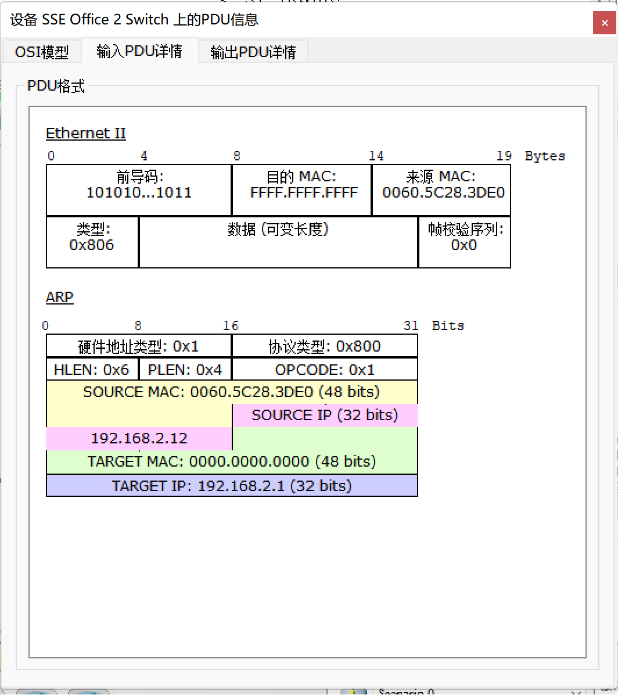  
从图中可以看出以下关键信息：
Ethernet II部分：
* 前导码：101010...1011，用于同步网络设备之间的时钟频率，以确保数据的正确解读。
* 目的 MAC 地址：FF:FF:FF:FF:FF:FF，这是广播地址，意味着这个ARP请求被发送到网络上的所有设备。
* 来源 MAC 地址：00:60:5C:28:3D:E0，这是发出ARP请求的设备的物理地址。
* 类型：0x806，表示这是一个ARP数据包。
ARP部分： 
* ARP 操作类型：0x1，表示这是一个ARP请求。
* 硬件地址类型和协议类型：都是0x1，分别代表以太网硬件地址和IPv4协议地址。
* HLEN 和 PLEN：分别为0x6和0x4，表示硬件地址长度为6个字节（通常为以太网的MAC地址），而协议地址长度为4个字节（即IPv4地址）。
* SOURCE MAC 和 SOURCE IP：分别是00:60:5C:28:3D:E0和192.168.2.12，这表明请求来自具有该MAC地址和IP地址的设备。
* TARGET MAC 和 TARGET IP：分别是00:00:00:00:00:00和192.168.2.1，这表示请求是针对目标IP地址192.168.2.1的，但目前还不知道其对应的MAC地址，因此需要通过ARP请求来获取。

这个ARP数据包是一个由设备（源MAC地址为00:60:5C:28:3D:E0，源IP地址为192.168.2.12）向整个局域网广播的一个请求，目的是为了查询IP地址为192.168.2.1的设备的MAC地址。当其他设备接收到这个请求后，如果它们的IP地址与请求的目标IP地址匹配，就会回复一个包含自己MAC地址的ARP响应。

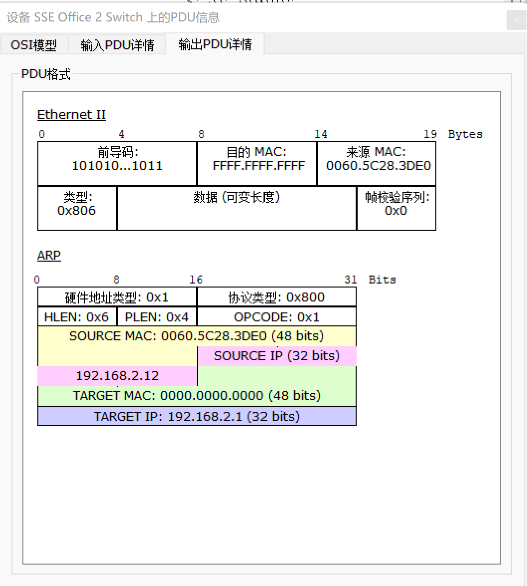  
从图中可以看出以下关键信息：  
* 前导码：101010...1011，用于同步网络设备之间的时钟频率，以确保数据的正确解读。
* 目的 MAC 地址：FFFF.FFFF.FFFF，这是一个广播地址，表示这个ARP请求将会发送给网络中的所有设备。
* 来源 MAC 地址：00:60:5C:28:3D:E0，这是发出ARP请求的设备的物理地址。
* 类型：0x806，标识这是一个ARP数据包。
* ARP 操作类型：0x1，表示这是一个ARP请求。
* HLEN 和 PLEN：分别是0x6和0x4，表示硬件地址长度为6个字节（通常为以太网的MAC地址），而协议地址长度为4个字节（即IPv4地址）。
* SOURCE MAC 和 SOURCE IP：分别是00:60:5C:28:3D:E0和192.168.2.12，这表明请求来自具有该MAC地址和IP地址的设备。
* TARGET MAC 和 TARGET IP：分别是00:00:00:00:00:00和192.168.2.1，这表示请求是针对目标IP地址192.168.2.1的，但目前还不知道其对应的MAC地址，因此使用全零表示。

这个ARP数据包是由IP地址为192.168.2.12的设备发出的，它试图查找IP地址为192.168.2.1的设备的MAC地址。因为目标MAC地址是全零，所以这是一个广播请求，网络中的所有设备都会收到并检查是否自己的IP地址与请求的目标IP相匹配。如果匹配，设备会回应一个ARP响应，告诉发起方自己的MAC地址。

### 11.3 TCP数据包分析解读

#### 11.3.1 TCP概述

1. **概述**：TCP（传输控制协议）是传输层的基于连接的协议，提供可靠的全双工数据传输。它通过序号和确认号机制确保数据按序传递且无损坏，并利用窗口机制进行流量控制，以及采用拥塞控制算法防止网络拥堵。虽然TCP 需要在端系统中维护连接状态，带来一定的时间和空间开销，但其可靠性和数据完整性使其广泛应
用于需要稳定传输的场景。相比之下，UDP 不维护连接状态，开销较小，适用于
对传输速度要求高而对可靠性要求低的实时应用。

2. **TCP报文格式**

    TCP报文是 TCP 层传输的数据单元，也叫报文段。

     

    - 源端口号（16位）和目的端口号（16位）：这两个字段分别用来标识发送端和接收端的端口号，端口号用于识别主机上的特定应用程序。

    - 序号（32位）：用于对数据字节流进行排序和重组。序号是该报文段第一个字节的序号。

    - 确认号（32位）：如果设置了ACK标志，则该值是发送方期望收到的下一个序号，即已成功接收数据的确认。

    - 数据偏移（4位）：表示TCP报文头的长度，单位是32位字。这是因为TCP头部可能包含不等长的选项字段。

    - 保留（6位）：保留未来使用，目前应为零。

    - 控制位/标志位（6位）：包括URG、ACK、PSH、RST、SYN和FIN等控制标志，用于控制TCP的状态和流程。例如，SYN用于建立连接，FIN用于释放连接。

    - 窗口大小（16位）：用于流量控制，表示从确认号开始，接收端愿意接收的数据量（单位为字节）。

    - 校验和（16位）：用于检测数据在传输过程中的任何错误。

    - 紧急指针（16位）：如果URG标志被设置，该字段是一个正的偏移量，它从序号字段开始计算，指出在数据流中紧急数据的结束位置。

    这种结构使TCP能够提供一种可靠的数据传输方式，通过序号和确认号可以确保数据的正确顺序和数据完整性，控制位用于协调数据传输过程中的不同情况。

#### 11.3.2 TCP报文分析

##### 11.3.2.1 报文抓取

从 Realtime 模式切换至 Simulation 模式。在Outside PC1 的Web Browser 中输入服务器网址http://web.tongji.edu.cn，产生TCP数据报文；点击 Capture/Forward 单步执行，也可以 点击 Auto Capture/Play 自动执行 ，查看相关数据。在 Even List 中 的 Info 栏 可以查看相关信息 。
   
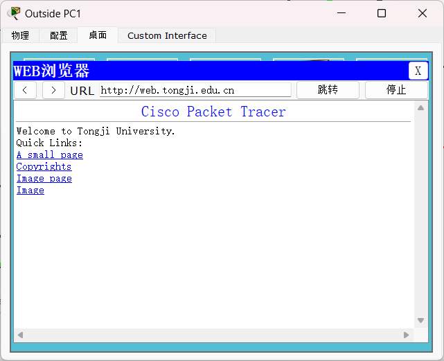 

 

##### 11.3.2.2 报文分析

1. OSI模型

**报文介绍**

  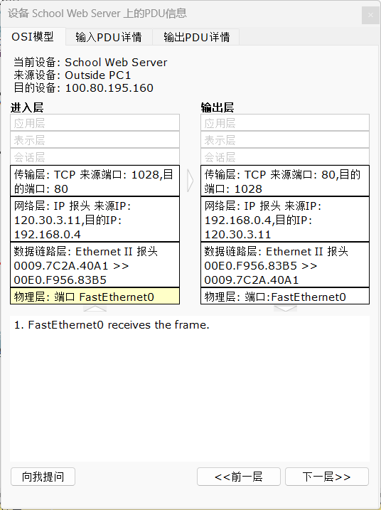

- 应用信息：
  - 发送方应用：School Web Server
  - 接收方应用：Outside PC1

- 传输层：
  - 源端口和目标端口： 发送方使用的TCP端口是1028，而目的地端口是80（HTTP服务的标准端口）。

- 网络层：
  - IP地址：
    - 源IP地址：120.30.3.11
    - 目标IP地址：192.168.0.4
  - 这表明数据包是从一个外部地址发送到内部网络（可能是NAT背后的地址）。

- 数据链路层：
  - MAC地址：
    - 源MAC地址：0009.7C2A.40A1
    - 目标MAC地址：000E.F956.83B5
  - 这显示了物理网络设备间的帧传输。
  
- 接口信息：
  - 数据是通过接口FastEthernet0传送的。

**报文处理流程**

- 接收数据帧：FastEthernet0 接口收到从源MAC地址发来的以太网帧。
- MAC地址检查：设备检查以太网帧的目标MAC地址是否与接口的MAC地址匹配或者是广播/多播地址。
- 解封装至IP层：如果MAC地址验证通过，设备将数据帧解封装，提取出IP包。
- IP地址检查：设备检查IP包的目标IP地址是否与设备的IP地址匹配或已经配置的路由规则。
- IP包路由（如果需要）：根据IP头部的目标IP地址，路由器决定IP包的下一跳。如果目标IP在本地网络中，将直接传输；如果不是，将按照路由表转发到下一网络。
- TCP段处理：
  - 在网络层验证通过后，IP包中的TCP段被发送到传输层处理。
  - TCP层检查段的端口号，确定数据包是为哪个应用程序或服务。
- TCP连接建立与数据传输：
  - 如果是一个新的连接请求，TCP层会处理连接建立过程（例如三次握手）。
  - 如果是已经建立的连接，TCP层会根据TCP头信息（如序号和确认号）处理和排序接收到的数据段。
- 数据传递给应用层：一旦数据在TCP层被完全接收并且按序组装好，它将被传递到对应的应用层（在此例中，可能是Web服务器处理HTTP请求）。
- 应用层处理：应用程序处理接收到的数据，并准备响应。在此案例中，HTTP服务器可能会处理对Web页面的请求，并生成一个HTTP响应。
- 响应传回过程：生成的响应通过相反的过程传回给请求者。即从应用层到TCP，再封装成IP包，最后封装成以太网帧通过物理网络传输。

2. 输入PDU详情


- 以太网层（Ethernet II）
  - 目的MAC地址： 000E.F956.83B5（通常是接收设备的硬件地址）
  - 源MAC地址： 0009.7C2A.40A1（发送设备的硬件地址）
  - 协议类型： 0x800 表示承载的是IP数据包
- IP层
  - 版本： 4 （IPv4）
  - IHL (Internet Header Length)： 表示头部长度，单位为32位字，这里没有具体数值显示
  - 服务类型（DSCP）： 0x0 （默认优先级）
  - 总长度： 44 字节（包括头部和数据）
  - 标识、标志、片偏移： 用于IP分片和重组的处理
  - 生存时间（TTL）： 125（数据包在网络中的最大跳数）
  - 协议： 0x6 表示承载的是TCP段
  - 源IP地址： 120.30.3.11
  - 目的IP地址： 192.168.0.4
- TCP层
  - 源端口： 1028（发起连接的端口号）
  - 目标端口： 80（Web服务常用端口）
  - 序列号： 0 （用于数据排序和重传控制，这里表示是一个连接初始化请求）
  - 确认号： 0 （用于确认接收，这里不包含确认信息）
  - 标志位： SYN（表示这是一个连接建立请求）
  - 窗口大小： 没有详细显示，用于流量控制

从TCP层的信息看，这个报文应该是一个TCP连接的初始化请求（SYN），用于建立客户端和服务器之间的连接。整个报文的结构和字段内容表明这是网络通信中的一个典型TCP握手请求的第一步，旨在建立连接以便进一步通信。

这个数据包的处理将遵循TCP的三次握手过程，首先是接收端对这个SYN请求响应一个SYN-ACK，之后发送端会回送一个ACK，从而完成连接建立过程。

3. 输出PDU详情


- 以太网层（Ethernet II）
  - 目的MAC地址： 000E.F956.83B5（通常是接收设备的硬件地址）
  - 源MAC地址： 0009.7C2A.40A1（发送设备的硬件地址）
  - 协议类型： 0x800，表示承载的是IP数据包
- IP层
  - 版本： 4 （IPv4）
  - IHL (Internet Header Length)： 头部长度，单位为32位字，没有具体数值显示
  - 服务类型（DSCP）： 0x0 （默认优先级）
  - 总长度： 44 字节（包括头部和数据）
  - 标识、标志、片偏移： 用于IP分片和重组的处理
  - 生存时间（TTL）： 128（数据包在网络中的最大跳数）
  - 协议： 0x6 表示承载的是TCP段
  - 源IP地址： 192.168.0.4
  - 目的IP地址： 120.30.3.11
- TCP层
  - 源端口： 80（Web服务常用端口）
  - 目标端口： 1028（外部PC发起连接的端口号）
  - 序列号： 0 （用于数据排序和重传控制，这里表示是一个连接响应）
  - 确认号： 1 （用于确认接收，表示接收到序列号为1的数据）
  - 标志位： SYN + ACK（表示这是一个对SYN请求的响应，并期待对方确认）
  - 窗口大小： 没有详细显示，用于流量控制

这个TCP报文是TCP三次握手过程中的第二步，即服务器对客户端的SYN请求回应一个SYN+ACK。服务器通告客户端它已经准备好了接收数据，并期待客户端的最终确认（ACK）来完成连接的建立。这个响应是建立TCP连接必需的，使得双方同步序列号和确认号，以便开始安全的数据传输。

该过程完成后，客户端应发送一个ACK报文给服务器，以确认这次SYN+ACK，从而完成三次握手，建立起稳定的TCP连接。

### 11.4 IP数据包分析解读

#### 11.4.1 IP数据包概述

IP（Internet Protocol，互联网协议）是互联网协议栈中网络层的核心协议，用于在不同网络之间传输数据。IP协议定义了数据包的封装格式、寻址方法、路由选择和数据包的传输等内容。以下是IP协议的一些主要特性和功能：

1. 版本
  目前主要使用的IP协议版本有两个：

    - IPv4（Internet Protocol version 4）
    - IPv6（Internet Protocol version 6）

2. IPv4
  IPv4是目前最广泛使用的IP协议版本。IPv4地址是32位的，通常用点分十进制表示（例如：192.168.0.1）。IPv4数据包由两个主要部分组成：头部和数据部分。

     - IPv4头部格式
      IPv4头部通常包括以下字段：
        - 版本（Version）: 4位，表示IP协议版本号。
        - 头部长度（IHL, Internet Header Length）: 4位，表示头部的长度。
        - 服务类型（Type of Service, ToS）: 8位，定义服务质量。
        - 总长度（Total Length）: 16位，表示整个数据包的长度。
        - 标识（Identification）: 16位，用于唯一标识主机发送的每一分组。
        - 标志（Flags）: 3位，控制或标记分片。
        - 片偏移（Fragment Offset）: 13位，指示分片在原始数据包中的位置。
        - 生存时间（TTL, Time to Live）: 8位，限制数据包在网络中的生存时间。
        - 协议（Protocol）: 8位，指示上层协议，如TCP、UDP等。
        - 头部校验和（Header Checksum）: 16位，用于检验头部的错误。
        - 源地址（Source Address）: 32位，发送方的IP地址。
        - 目的地址（Destination Address）: 32位，接收方的IP地址。
        - 选项（Options）和填充（Padding）: 可选字段，用于控制和调试。
3. IPv6
    IPv6是IPv4的升级版本，设计用于替代IPv4，解决地址枯竭等问题。IPv6地址是128位的，通常用冒号分隔的十六进制表示（例如：2001:0db8:85a3:0000:0000:8a2e:0370:7334）。

    - IPv6头部格式
      - IPv6头部相较于IPv4头部简化了许多，主要字段包括：
      - 版本（Version）: 4位，表示IP协议版本号。
      - 流量分类（Traffic Class）: 8位，类似于IPv4的服务类型。
      - 流标签（Flow Label）: 20位，用于标记数据流。
      - 有效载荷长度（Payload Length）: 16位，表示数据部分的长度。
      - 下一个头部（Next Header）: 8位，指示下一个头部的协议类型（类似于IPv4的协议字段）。
      - 跳限制（Hop Limit）: 8位，类似于IPv4的TTL。
      - 源地址（Source Address）: 128位，发送方的IP地址。
      - 目的地址（Destination Address）: 128位，接收方的IP地址。
4. IP协议的功能
    - 寻址和路由选择: IP协议提供了统一的地址格式，并支持通过路由器在不同网络之间传输数据包。
    - 数据包分片和重组: 当数据包大小超过网络MTU（最大传输单元）时，IP协议支持将数据包分片，并在接收端重组。
    - 错误检测: 通过头部校验和字段，IP协议可以检测并丢弃包含错误的头部。
    - 服务质量: 通过服务类型字段，IP协议支持不同的数据包设置不同的优先级。
#### 11.4.2 IP数据报文分析

##### 11.4.2.1 报文抓取

从Realtime 模式切换至Simulation 模式。在Outside PC1 的Web Browser 中输入服务器网址http://web.tongji.edu.cn，产生IP 数据报文。点击Capture/Forward 单步执行，也可以点击Auto Capture/Play 自动执行，查看相关数据。在Even List 中的Info 栏可以查看相关信息。

 

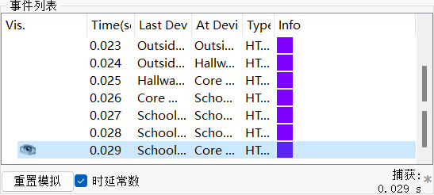

##### 11.4.2.2 报文分析

1. OSI模型
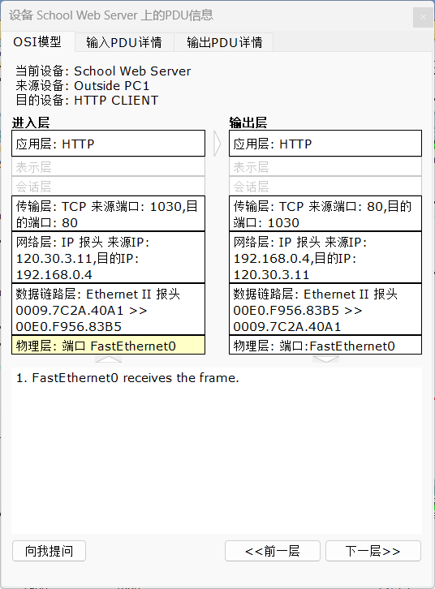

- 基本信息：
  - 源主机：School Web Server
  - 目的主机：Outside PC1
  - 通信协议：HTTP
- 传输层：
  - 源端口：TCP 端口1030 (非标准HTTP端口，可能用于测试或非标准用途)
  - 目标端口：HTTP 标准端口80
- 网络层：
  - 源IP地址：120.30.3.11
  - 目的IP地址：192.168.0.4 (典型的局域网地址)
- 数据链路层：
  - 源MAC地址：0009.7C2A.40A1
  - 目的MAC地址：0000.F956.83B5
- 工作流程：
  - 当HTTP请求从客户端发起时，数据从应用层开始，依次通过传输层、网络层、数据链路层，并在物理层被发送出去。
  - 数据到达服务器后，会通过相同的层次，但顺序相反，即从物理层到数据链路层，再到网络层、传输层，最后是应用层。
  - 在应用层，服务器处理请求并发送响应，响应数据同样通过这些层次回到客户端。
  
2. 输入PDU详情
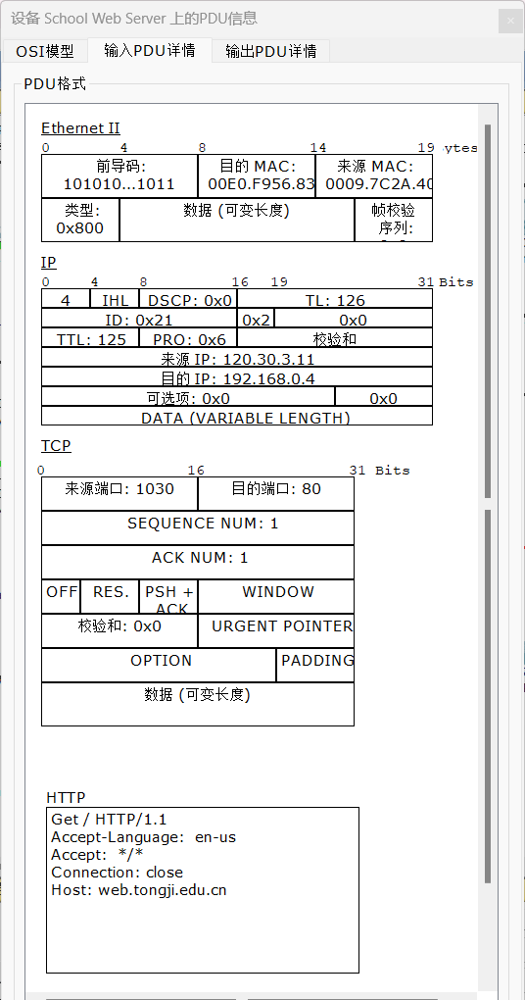

该报文展示了一个从源IP地址120.30.3.11发送到目的IP地址192.168.0.4的HTTP请求。它通过以太网传输，IP层使用IPv4协议，TCP层在源端口1030和目的端口80之间通信，并包含一个简单的HTTP GET请求。这是一个典型的HTTP请求报文，展示了网络通信中各层协议的具体信息。

- 以太网II（Ethernet II）层
  - 前导码（Preamble）: 101010...1011
  - 目的MAC地址: 00E0.F956.83
  - 源MAC地址: 0009.7C2A.4D
  - 类型（Type）: 0x0800（表示IP协议）
  - 数据: 可变长度
  - 帧校验序列（FCS）: 未显示
- IP层
  - 版本（Version）: 4
  - IHL（Internet Header Length）: 5
  - DSCP（Differentiated Services Code Point）: 0x0
  - 总长度（Total Length）: 126字节
  - 标识（Identification）: 0x21
  - 标志（Flags）: 0x2
  - 片偏移（Fragment Offset）: 0x0
  - 生存时间（TTL）: 125
  - 协议（Protocol）: 0x6（表示TCP协议）
  - 头部校验和（Header Checksum）: 0x0
  - 源IP地址: 120.30.3.11
  - 目的IP地址: 192.168.0.4
  - 数据: 可变长度
- TCP层
  - 源端口（Source Port）: 1030
  - 目的端口（Destination Port）: 80
  - 序列号（Sequence Number）: 1
  - 确认号（Acknowledgment Number）: 1
  - 偏移（Offset）: 5
  - 保留（Reserved）: 0
  - 标志（Flags）: PSH, ACK
  - 窗口大小（Window Size）: 未显示
  - 校验和（Checksum）: 0x0
  - 紧急指针（Urgent Pointer）: 未显示
  - 数据: 可变长度
- HTTP层
  - 请求行（Request Line）: GET / HTTP/1.1
  - 头部字段（Header Fields）:
    - `Accept-Language`: en-us
    - `Accept`: /
    - `Connection`: close
    - `Host`: web.tongji.edu.cn

3. 输出PDU详情


该报文展示了一个从源IP地址`192.168.0.4`发送到目的IP地址`120.30.3.11`的HTTP响应。它通过以太网传输，IP层使用IPv4协议，TCP层在源端口80和目的端口1030之间通信，并包含一个HTTP响应。这是一个典型的HTTP响应报文，展示了网络通信中各层协议的具体信息。HTTP响应的状态码是200，表示请求成功，响应内容的长度为303字节，类型为text/html。

- 以太网II（Ethernet II）层
  - 前导码（Preamble）: 101010...1011
  - 目的MAC地址: 00E0.F956.83
  - 源MAC地址: 0009.7C2A.4D
  - 类型（Type）: 0x0800（表示IP协议）
  - 数据: 可变长度
  - 帧校验序列（FCS）: 未显示
- IP层
  - 版本（Version）: 4
  - IHL（Internet Header Length）: 5
  - DSCP（Differentiated Services Code Point）: 0x0
  - 总长度（Total Length）: 425字节
  - 标识（Identification）: 0xf
  - 标志（Flags）: 0x2
  - 片偏移（Fragment Offset）: 0x0
  - 生存时间（TTL）: 128
  - 协议（Protocol）: 0x6（表示TCP协议）
  - 头部校验和（Header Checksum）: 0x0
  - 源IP地址: 192.168.0.4
  - 目的IP地址: 120.30.3.11
  - 数据: 可变长度
- TCP层
  - 源端口（Source Port）: 80
  - 目的端口（Destination Port）: 1030
  - 序列号（Sequence Number）: 1
  - 确认号（Acknowledgment Number）: 107
  - 偏移（Offset）: 5
  - 保留（Reserved）: 0
  - 标志（Flags）: PSH, ACK
  - 校验和（Checksum）: 0x0
  - 数据: 可变长度
- HTTP层
  - 状态行（Status Line）: `HTTP/1.1 200 OK`
  - 头部字段（Header Fields）:
    - `Connection`: close
    - `Content-Length`: 303
    - `Content-Type`: text/html
    - `Server`: PT-Server/5.2
  - 数据: HTTP DATA..
  - 
## 文档更新日期

2024年6月6日

-------------------------------------------------------

提交：

* 项目功能说明和网络拓扑规划设计文档，如地址分配、服务器功能说明等
* 项目文件
* 所有项目文件打包于一个文件夹下，文件夹命名：**{组号}_林继申_2250758.rar**