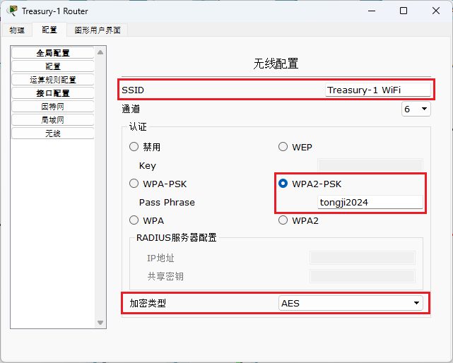
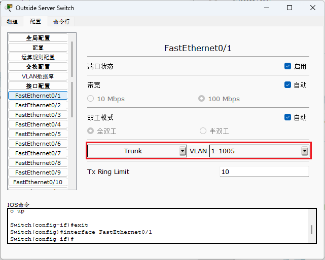
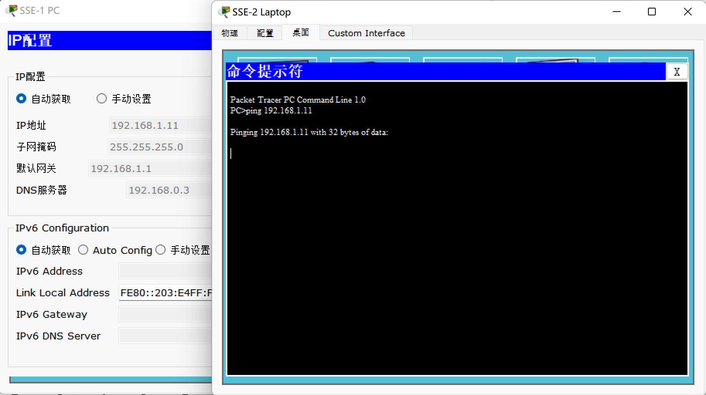

# Final Lab: Campus Network Simulation

## 综合实验：基于 Packet Tracer 的校园网仿真模拟实验

* **成员分工**：
  | 姓名 | 学号 | 分工 | 工作量 |
  | :---: | :---: | :---: | :---: |
  | 林继申 (组长) | 2250758 | 网络设计、网络搭建、网络测试、实验报告与 PPT | 25% |
  | 杜天乐 | 2251310 | 网络设计、网络搭建、网络测试、实验报告与 PPT | 25% |
  | 刘淑仪 | 2251730 | 网络设计、网络搭建、网络测试、实验报告与 PPT | 25% |
  | 吴婉宁 | 2252443 | 网络设计、网络搭建、网络测试、实验报告与 PPT | 25% |
* **指导教师**：陈伟超
* **实验地点**：济事楼 330
* **实验平台**：Cisco Packet Tracer 6.0
* **实验时间**：2024 年 5 月 30 日 ~ 2024 年 6 月 12 日
* **答辩时间**：2024 年 6 月 13 日

-------------------------------------------------------

[TOC]

-------------------------------------------------------

## 1 问题描述

学校有若干部门，包括各个院系，财务处，行政管理部门等，请为此设计网络架构，其中需要满足的功能有：

* 每个部门配置自己独立局域网，且包含自己的文件服务器和 Web 服务器，实现部门间的隔离和互访；
* 学校统一提供接入到互联网的接口，需配置 NAT 功能；
* 学校需提供一个外网可访问的 Web 服务器，以及一个各部门公用的文件服务器；
* 网络需提供 WiFi 接入功能；
* 行政管理部门须有访问接入控制 ACL 设计；
* 在 Packet Tracer 内随机抓取某类型的数据包并解读，如 TCP，IP，MAC，ARP 等。

## 2 网络拓扑结构设计

### 2.1 总体网络拓扑设计

根据需求，总体网络拓扑设计如下：


整个网络结构分为内网和外网两大部分。

* 内网为主要部分，由核心层、软件学院（SSE）、财务处（Treasury）、行政管理部门（Admin）以及 VOIP 局域网五个子网构成，每个子网都承担着不同的功能，服务于特定的用户群体和业务需求。
* 外网可以与学校内网发邮件、访问公网 IP 等，校内用户也可以随时访问内网。

### 2.2 内网网络拓扑设计

#### 2.2.1 核心层网络拓扑设计

核心层网络拓扑设计如下：


核心层是整个网络的核心，主要由核心交换机和 5 台服务器（School DHCP Server、School DNS Server、School Web Server、School File Server、School Email Server）组成，它们负责整个内网的数据交换和路由。核心层的设计需要确保高可用性和高带宽，以满足大量数据的高速传输需求。核心层中的 E-mail 服务器、DHCP 服务器、Web 服务器、DNS 服务器以及 File 服务器均为内网公用服务器，可以被其他部门访问。

#### 2.2.2 软件学院网络拓扑设计

软件学院网络拓扑设计如下：


这个子网服务于软件学院，其中包括了服务器、个人电脑、笔记本电脑和平板电脑等设备，为学生和教职工提供网络资源和服务。学院内还设置了 WiFi 服务，通过无线路由器接入。软件学院与其他两个部门相互独立，无法相互访问。

软件学院内设有两个办公室（SSE Office 1、SSE Office 2）和两台服务器（SSE Web Server、SSE File Server）。

* 办公室之间相互独立，例如 SSE Office 1 不能访问 SSE Office 2。
* 两台服务器，一台是负责软件学院网络的 Web 服务器，另一台是负责文件传输的 File 服务器，都是软件学院内的公用服务器，其他部门无法访问。

#### 2.2.3 财务处网络拓扑设计

财务处网络拓扑设计如下：


这个子网专门为财务部门设计。与软件学院类似，财务处与其他两个部门相互独立，无法相互访问。财务处内还设置了 WiFi 服务，通过无线路由器接入。

部门内设有两个办公室（Treasury Office 1 和 Treasury Office 2）和两台服务器（Treasury Web Server 和 Treasury File Server）。

* 办公室之间相互独立，例如 Treasury Office 1 不能访问 Treasury Office 2。
* 两台服务器，一台是负责财务处网络的 Web 服务器，另一台是负责文件传输的 File 服务器，都是部门的公用服务器，其他部门无法访问。

#### 2.2.4 行政管理部门网络拓扑设计

行政管理部门网络拓扑设计如下：


这个子网为行政管理人员提供网络服务，包括处理日常行政事务的电脑和服务器。这些设备需要访问内网中的各种资源和应用程序，以支持管理工作。同上两个部门，行政管理部门与其他两个部门相互独立，无法相互访问。部门内设置了 WiFi 服务。

部门内设有两个办公室（Admin Office 1 和 Admin Office 2）和两台服务器（Admin Web Server 和 Admin File Server）。

* 办公室之间相互独立。
* 两台服务器，一台是负责财务处网络的 Web 服务器，另一台是负责文件传输的 File 服务器，都是部门的公用服务器，其他部门无法访问。

#### 2.2.5 VOIP 局域网网络拓扑设计

VOIP 局域网网络拓扑设计如下：


这个子网是一个基于 IP 的语音通信网络，提供了 IP 电话服务，为每一个部门配备了电话。

IP 电话直接由网关路由器（Hallway Router）提供，不接入内网。从拓扑图上看，IP 电话并不在各部门的子网中，但逻辑上每台电话都属于一个部门（SSE IP Phone 属于软件学院，Treasury IP Phone 属于财务处，Admin IP Phone 属于行政管理部门）这样 VOIP 局域网不仅实现了各部门之间拨打和接通 IP 电话，还可以访问外网。

网关路由器（Hallway Router）：Hallway Router 提供 NAT 网络地址转换服务，它允许多个内部网络设备共享单个或少量公网 IP 地址。

* 使用公网 IP 配置内网核心层的 Web 服务器和 File 服务器：
  在这种情况下，Web 服务器和 File 服务器被直接配置了公网 IP 地址。这两个服务器可以直接从互联网上访问，不需要通过 NAT 转换。外网用户可以通过这些公网 IP 地址直接访问这些服务器，就像访问任何其他互联网上的服务器一样。这种配置用于需要对外提供服务的服务器，它将 Web 服务器和 File 服务器开放给了外网，以便外部用户可以访问。
* 给内网其余设备配备 NAT 池：
  对于内网中的其他设备，它们被配置使用 NAT 池中的私有 IP 地址。当这些设备需要访问互联网时，它们的私有 IP 地址会被转换成 NAT 池中的公网 IP 地址之一。这种转换过程允许这些设备共享有限的公网 IP 地址。这样，即使公网 IP 地址数量有限，内网中的多个设备也可以访问互联网上的外部资源，如 Web 服务器、DNS 服务器等。NAT 池中的公网 IP 地址在设备访问互联网时被复用，每个设备的私有 IP 地址在出站流量中被替换为公网 IP 地址，同时记录下对应的端口信息，以便在响应流量返回时能够正确地转发回原始的内部设备。

通过 NAT 服务，Hallway Router 有效地管理了公网 IP 地址的使用，确保了内网设备能够访问互联网，同时也保护了内部网络的安全性，因为私有 IP 地址不会直接暴露在公网上。

### 2.3 外网网络拓扑设计

外网网络拓扑设计如下：


外网部分是将学校内网连接到外部网络，它允许内网用户访问外部资源，如互联网上的网站、电子邮件服务等。同时，外网也允许外部用户访问内网中配置了公网 IP 的服务器，如学校的 Web 服务器和文件服务器。外网通过路由器与内网相连，该路由器负责处理内网与外网之间的数据流，确保数据的安全传输。

## 3 核心层网络配置

### 3.1 Vlan 配置

在设计过程中，我们通过配置虚拟局域网（Vlan）为各个部门建立独立的局域网，采用 Vlan Trunking Protocol（VTP）协议来简化 Vlan 的管理和配置过程。

首先将核心交换机（Core Multilayer Switch）配置为 VTP 的服务器 Server 模式，让它成为 Vlan 数据库中中央管理点。


接着在核心交换机上配置 Vlan，确保所有 Vlan 的新增和更改都要先在核心交换机上完成。

查看 Vlan 配置信息：


配置网络交换机（Core Multilayer Switch）端口：


* `switchport trunk encapsulation dot1q`：这条命令用于配置交换机端口使用 dot1q 封装格式。dot1q 是一种广泛使用的 Vlan 标签协议，它允许在单个物理链路上传输多个 Vlan 的数据。这条命令确保了交换机端口使用标准的 dot1q 封装，以便能够正确地识别和处理通过该端口传输的 Vlan 标签。
* `switchport mode trunk`：这条命令将交换机端口设置为 trunk 模式。在 trunk 模式下，端口允许多个 Vlan 的数据通过，这对于连接两个交换机或者连接交换机到支持 Vlan 的设备（如路由器）是非常重要的。trunk 模式允许多个 Vlan 的数据共享同一个物理链路，同时保持每个 Vlan 的独立性。

配置后如下所示（以 FastEthernet0/3 接口为例）：


将核心层的交换机（School Core Domain Switch）的 FastEthernet0/1 接口设置为 Trunk 模式：


将 School Core Domain Switch 的 FastEthernet0/2-FastEthernet0/6 接口设置为 Access 模式，并指定段扩所属的 Vlan 为 Vlan 2（以 FastEthernet0/2 为例）：


在核心交换机完成 Vlan 配置后，VTP 服务器会自动将这些更新信息传播给所有处于 VTP 客户端模式的交换机。这样，整个网络中的交换机都能够保持 Vlan 信息的同步，确保每个部门都能拥有一个独立且安全的通信环境。

### 3.2 服务器静态 IP 配置

为了快速定位网络核心中的服务器，并且考虑到这些服务器通常较为稳定，不会频繁增减，我们为它们分配静态 IP 地址。以下是分配的详细情况：

| 服务器 | IP 地址 | 子网掩码 | 网关 | DNS |
| :---: | :---: | :---: | :---: | :---: |
| School DHCP Server | 192.168.0.2 | 255.255.255.0 | 192.168.0.1 | 192.168.0.3 |
| School DNS Server | 192.168.0.3 | 255.255.255.0 | 192.168.0.1 | 192.168.0.3 |
| School Web Server | 192.168.0.4 | 255.255.255.0 | 192.168.0.1 | 192.168.0.3 |
| School File Server | 192.168.0.5 | 255.255.255.0 | 192.168.0.1 | 192.168.0.3 |
| School Email Server | 192.168.0.6 | 255.255.255.0 | 192.168.0.1 | 192.168.0.3 |

### 3.3 DHCP 配置

启用核心层 DHCP 服务器（School DHCP Server）的 DHCP，并进行 DHCP 配置：


## 4 内网网络配置

### 4.1 软件学院网络配置

#### 4.1.1 Vlan配置

将软件学院交换机（SSE Multilayer Switch）配置为 VTP 的 Client 模式，使得软件学院可以同步核心层的所有 Vlan。


Vlan11、Vlan12、Vlan13，分别对应软件学院的三个虚拟局域网（SSE Office1、SSE Office2、SSE Servers）
在核心交换机（Core Multilayer Switch）上为新建的 3 个 Vlan 配置 IP 地址，代码如下：

```
interface Vlan11
ip address 192.168.1.1 255.255.255.0
no shutdown
exit
interface Vlan12
ip address 192.168.2.1 255.255.255.0
no shutdown
exit
interface Vlan13
ip address 192.168.3.1 255.255.255.0
no shutdown
exit
```

Vlan11、Vlan12、Vlan13 配置信息如下：

| Vlan 编号 | Vlan 名称 | 局域网 | 网段 | DNS |
| :---: | :---: | :---: | :---: | :---: |
| 11 | sse1 | 软件学院办公室1 | 192.168.1.1 | 255.255.255.0 |
| 12 | sse2 | 软件学院办公室2 | 192.168.2.1 | 255.255.255.0 |
| 13 | sse1-2 | 软件学院服务器 | 192.168.3.1 | 255.255.255.0 |

配置网络交换机（SSE Multilayer Switch）端口：


将核心交换机到部门总交换机、部门总交换机到部门分交换机的接口设置为 Trunk。

配置后如下所示（以 FastEthernet0/1 接口为例）：


将部门分交换机到终端的接⼝设置为 Access，并选择对应 Vlan。


#### 4.1.2 ACL 配置

ACL（访问控制列表）的主要功能是控制通过网络设备的数据流，通过允许或拒绝特定流量来保护和管理网络资源。

针对服务器 Vlan（Vlan13）：

* 允许同一部门内的Vlan（Vlan11 和 Vlan12）进行访问
* 拒绝其他部门 Vlan 对服务器 Vlan 的访问

针对不同办公室：

* 允许部门服务器（Vlan13）访问
* 允许核心层服务器访问
* 拒绝其他部门 Vlan 访问
* 允许外部访问

在核心交换机配置如下：


代码作用如下：

```
// 针对 Vlan11 的 ACL（access-list 111）
access-list 111 permit ip 192.168.3.0 0.0.0.255 192.168.1.0 0.0.0.255 // 允许来自 Vlan13（192.168.3.0/24）的流量访问 Vlan11（192.168.1.0/24）
access-list 111 permit ip 192.168.0.0 0.0.0.255 192.168.1.0 0.0.0.255 // 允许来自核心层服务器（192.168.0.0/24）的流量访问 Vlan11（192.168.1.0/24）
access-list 111 deny ip 192.168.0.0 0.0.255.255 192.168.1.0 0.0.0.255 // 拒绝其他部门的流量（192.168.0.0/16 的所有子网）访问 Vlan11（192.168.1.0/24）
access-list 111 permit ip any any // 允许所有其他流量。这是一条默认允许规则，以防止拒绝所有流量
int vlan 11
ip access-group 111 in // 将 ACL 111 应用于 Vlan11 的入站流量
ip access-group 111 out // 将 ACL 111 应用于 Vlan11 的出站流量
exit

// 针对 Vlan12 的 ACL（access-list 112）
access-list 112 permit ip 192.168.3.0 0.0.0.255 192.168.2.0 0.0.0.255 // 允许来自 Vlan13（192.168.3.0/24）的流量访问 Vlan12（192.168.2.0/24）
access-list 112 permit ip 192.168.0.0 0.0.0.255 192.168.2.0 0.0.0.255 // 允许来自核心层服务器（192.168.0.0/24）的流量访问 Vlan12（192.168.2.0/24）
access-list 112 deny ip 192.168.0.0 0.0.255.255 192.168.2.0 0.0.0.255 // 拒绝其他部门的流量（192.168.0.0/16 的所有子网）访问 Vlan12（192.168.2.0/24）
access-list 112 permit ip any any // 允许所有其他流量。这是一条默认允许规则，以防止拒绝所有流量
int vlan 12
ip access-group 112 in // 将 ACL 112 应用于 Vlan12 的入站流量
ip access-group 112 out // 将 ACL 112 应用于 Vlan12 的出站流量
exit

// 针对 Vlan13 的 ACL（access-list 113）
access-list 113 permit ip 192.168.1.0 0.0.0.255 192.168.3.0 0.0.0.255 // 允许来自 Vlan11（192.168.1.0/24）的流量访问 Vlan13（192.168.3.0/24）
access-list 113 permit ip 192.168.2.0 0.0.0.255 192.168.3.0 0.0.0.255 // 允许来自 Vlan12（192.168.2.0/24）的流量访问 Vlan13（192.168.3.0/24）
access-list 113 deny ip 192.168.0.0 0.0.255.255 192.168.3.0 0.0.0.255 // 拒绝其他部门的流量（192.168.0.0/16 的所有子网）访问 Vlan13（192.168.3.0/24）
access-list 113 permit ip any any // 允许所有其他流量
int vlan 13
ip access-group 113 in // 将 ACL 113 应用于 Vlan13 的入站流量
ip access-group 113 out // 将 ACL 113 应用于 Vlan13 的出站流量
exit
```

#### 4.1.3 DHCP 配置

在核心层的 DHCP 服务器（School DHCP Server）中为每个 Vlan 配置 DHCP 池：


在核心交换机（School Core Domain Switch）将 Vlan 启用 DHCP 中继功能：

```
int vlan 11
ip helper-address 192.168.0.2
exit
int vlan 12
ip helper-address 192.168.0.2
exit
int vlan 13
ip helper-address 192.168.0.2
exit
```

`ip helper-address` 命令是用来指定一个 UDP 广播消息的转发目标。当交换机收到来自该 Vlan 内的 UDP 广播数据包时，它会将这些数据包转发到指定的 ip helper-address。这在 DHCP、TFTP、NTP 等网络服务中非常有用，因为这些服务通常使用UDP广播进行通信。

例如，对于 Vlan11，`ip helper-address 192.168.0.2` 将为 Vlan11 配置 ip helper-address，并将所有 UDP 广播消息转发到 192.168.0.2，其他 Vlan 的配置与此类似。

配置好 ip helper-address 后，使用 `ip routing` 命令，启用核心交换机上的 IP 路由功能，这样交换机才能在不同的 IP 子网之间路由数据包。

开启不同办公室终端的 DHCP 服务（SSE-1 PC、SSE-2 PC、SSE-2 Laptop）。以 SSE-1 PC 为例，在 IP 配置界面选择“自动获取”。


可以看到 DHCP 请求成功，为 SSE-1 PC 自动分配了 IP 地址，网关，子网掩码和 DNS 服务器。

#### 4.1.4 服务器静态 IP 配置

服务器不会轻易改变，为其设置静态 IP。


#### 4.1.5 WiFi 配置

将软件学院办公室 1 的路由器（SSE-1 Router）的因特网配置为“自动获取”类型：


配置路由器局域网：


路由器无线配置：


配置 SSE PC、SSE Laptop、SSE Tablet PC、SSE Pda 四个设备的无线网络（以 SSE PC 为例）：


### 4.2 财务处网络配置

#### 4.2.1 Vlan 配置

同上，将财务处交换机（Treasury Multilayer Switch）配置为 VTP 的 Client 模式，使得财务处可以同步核心层的所由 Vlan。

```
vtp domain tongji
vtp clent
```

Vlan21、Vlan22、Vlan23，分别对应财务处的三个虚拟局域网（Treasury Office1、Treasury Office2、Treasury Servers），并在核心交换机（Core Multilayer Switch）上为新建的 3 个 Vlan 配置 IP 地址。

配置信息如下：

| Vlan 编号 | Vlan 名称 | 局域网 | 网段 | DNS |
| :---: | :---: | :---: | :---: | :---: |
| 21 | treasury1 | 财务处办公室1 | 192.168.11.1 | 255.255.255.0 |
| 22 | treasury2 | 财务处办公室2 | 192.168.12.1 | 255.255.255.0 |
| 23 | treasury1-2 | 财务处服务器 | 192.168.13.1 | 255.255.255.0 |

配置网络交换机（Treasury Multilayer Switch）端口：

```
interface FastEthernet0/1
switchport trunk encapsulation dot1q
switchport mode trunk
```

同上，将核心交换机到部门总交换机、部门总交换机到部门分交换机的接口设置为 Trunk，将部门分交换机到终端的接口设置为 Access，并选择对应 Vlan。

#### 4.2.2 ACL 配置

同上，配置财务处的 ACL。

针对服务器 Vlan（Vlan23）：

* 允许同一部门内的 Vlan（Vlan21 和 Vlan22）进行访问
* 拒绝其他部门 Vlan 对服务器 Vlan 的访问

针对不同办公室：

* 允许部门服务器（Vlan23）访问
* 允许核心层服务器访问
* 拒绝其他部门 Vlan 访问
* 允许外部访问

在核心交换机配置如下：


#### 4.2.3 DHCP 配置

同上，在核心层的 DHCP 服务器（School DHCP Server）中为每个 Vlan 配置 DHCP 池。

然后在核心交换机（School Core Domain Switch）将 Vlan 启用 DHCP 中继功能：

```
int vlan 21
ip helper-address 192.168.0.2
exit
int vlan 22
ip helper-address 192.168.0.2
exit
int vlan 23
ip helper-address 192.168.0.2
exit
```

开启不同办公室终端的 DHCP 服务（Treasury-1 PC、Treasury-2 PC、Treasury-2 Laptop）。以 Treasury-2 PC 为例，DHCP 请求成功，自动分配了 IP 地址，网关，子网掩码和 DNS 服务器。


#### 4.2.4 服务器静态 IP 配置

为财务处服务器配置静态 IP：


#### 4.2.5 WiFi 配置

同上，将财务处办公室 1 的路由器（SSE-1 Router）的因特网配置为“自动获取”类型。

配置路由器局域网：


路由器无线配置：



配置 Treasury PC、Treasury Laptop、Treasury Tablet PC、Treasury Pda 四个设备的无线网络（以 Treasury Laptop 为例）：


### 4.3 行政管理部门网络配置

#### 4.3.1 Vlan 配置

同上，将行政管理部门交换机（Admin Multilayer Switch）配置为 VTP 的 Client 模式，使得行政管理部门可以同步核心层的所由 Vlan。

```
vtp domain tongji
vtp clent
```

Vlan31、Vlan32、Vlan33，分别对应行政管理部门的三个虚拟局域网（Admin Office1、Admin Office2、Admin Servers），并在核心交换机（Core Multilayer Switch）上为新建的 3 个 Vlan 配置 IP 地址。

配置信息如下：

| Vlan 编号 | Vlan 名称 | 局域网 | 网段 | DNS |
| :---: | :---: | :---: | :---: | :---: |
| 31 | admin1 | 行政管理部办公室1 | 192.168.21.1 | 255.255.255.0 |
| 32 | admin2 | 行政管理部办公室2 | 192.168.22.1 | 255.255.255.0 |
| 33 | admin1-2 | 行政管理部服务器 | 192.168.23.1 | 255.255.255.0 |

配置网络交换机（Admin Multilayer Switch）端口：

```
interface FastEthernet0/1
switchport trunk encapsulation dot1q
switchport mode trunk
```

同上，将核心交换机到部门总交换机、部门总交换机到部门分交换机的接口设置为 Trunk，将部门分交换机到终端的接口设置为 Access，并选择对应 Vlan。

至此，各部门 Vlan 配置完成，可以通过命令 `show ip interface brief` 查看核心交换机所有接口的 IP 配置的摘要信息。


#### 4.3.2 ACL 配置

同上，配置行政管理部门的 ACL。

针对服务器 Vlan（Vlan33）：

* 允许同一部门内的 Vlan（Vlan31 和 Vlan32）进行访问
* 拒绝其他部门 Vlan 对服务器 Vlan 的访问

针对不同办公室：

* 允许部门服务器（Vlan33）访问
* 允许核心层服务器访问
* 拒绝其他部门 Vlan 访问
* 允许外部访问

在核心交换机配置如下：


至此，各部门ACL配置完成，可以通过命令 `show access-lists` 在核心交换机查看所有 ACL 配置信息，如下所示：


#### 4.3.3 DHCP 配置

同上，在核心层的 DHCP 服务器（School DHCP Server）中为每个 Vlan 配置 DHCP 池。

然后在核心交换机（School Core Domain Switch）将 Vlan 启用 DHCP 中继功能：

```
int vlan 31
ip helper-address 192.168.0.2
exit
int vlan 32
ip helper-address 192.168.0.2
exit
int vlan 33
ip helper-address 192.168.0.2
exit
```

开启不同办公室终端的 DHCP 服务（Admin-1 PC、Admin-2 PC、Admin-2 Laptop）。以 Admin-2 Laptop 为例，DHCP 请求成功，自动分配了 IP 地址，网关，子网掩码和 DNS 服务器。


#### 4.3.4 服务器静态 IP 配置

为行政管理部门服务器配置静态 IP：


#### 4.3.5 WiFi 配置

同上，将行政管理部门办公室 1 的路由器（Admin-1 Router）的因特网配置为“自动获取”类型。

配置路由器局域网：


路由器无线配置：


配置 Admin PC、Admin Laptop、Admin Tablet PC、Admin Pda 四个设备的无线网络（以 Admin Pda 为例）：


## 5 Web 服务配置

### 5.1 核心层 Web 服务配置

为学校内部总网配置 Web 服务器，分配静态 IP：


将 HTTP 和 HTTPS 设为启用，并修改 index.html 中的主页内容：


同理，为学校外网配置 Web 服务器，分配静态 IP。将 HTTP 和 HTTPS 设为启用，并修改 index.html 中的主页内容。


### 5.2 内网 Web 服务配置

为软件学院配置 Web 服务器，分配静态 IP：


将 HTTP 和 HTTPS 设为启用，并修改 index.html 中的主页内容：


同理，完成财务处、行政管理部门的 Web 服务器配置。

由于不开放给公网，这些部门都无需在外网 DNS 服务器上记录域名和 IP。通过先前的 ACL 配置可以限制外部访问，确保部门 Web 服务仅供内部使用。

### 5.3 外网 Web 服务配置

在核心 DNS 服务器上，为 Web 服务器配置内部各部门的 IP 与域名映射。


在外网 DNS 服务器上，将 Web 服务器的公网 IP 与学校域名绑定，确保外网可访问。


## 6 Email 服务配置

### 6.1 核心层 Email 服务配置

为学校内部总网配置 Email 服务器，分配静态 IP：


开启 SMTP 和 POP3，配置需要的邮箱用户的用户名及密码：


根据学校各部门的需求，创建了多个邮箱账户，每个账户均设置了唯一的用户名及安全密码。如上述步骤所示，同理，配置其他邮箱用户的用户名及密码。

### 6.2 内网 Email 服务配置

以 SSE-1 PC 为例，进⼊ SSE-1 PC 的邮件配置，从上到下依次输入：

* 用户信息：你的名字和邮箱地址。你的名字应输入与用户名一致的显示名称。邮箱地址遵循标准格式，即“用户名@域名”，确保邮件系统内外部的一致性和辨识度。
* 服务器信息：分为接入邮件服务器和发送邮件服务器。邮件客户端配置时，如果内部DNS已正确配置，则两个邮件服务器地址可直接使用设定的域名；反之，则需手动输入邮件服务器的内部 IP 地址作为邮件客户端服务器地址和转发邮件服务器地址。
* 登录信息：用户需输入与邮件服务器配置相匹配的用户名与密码，以完成身份验证，确保邮件服务的顺利接入。


点击保存完成此客户端配置，即可进行邮件操作。同理，进入其他客户端终端进行配置。

### 6.3 外网 Email 服务配置

在学校的内部 DNS 服务器中，为邮件服务器的内部 IP 地址创建 A Record，确保校园网内用户可以通过域名访问邮件服务。


在外部 DNS 服务器上，需映射该邮件服务器的公网 IP 地址至先前设定的域名，同时确保域名与邮件服务器配置的域名完全一致，以便全球互联网用户通过域名访问邮件服务，实现内外网邮件服务的无缝对接。


## 7 FTP 服务配置

### 7.1 核心层 FTP 服务配置

在核心层的 File 服务器管理界面中，启动 FTP 服务，确保服务器能够响应 FTP 客户端的连接请求。

同时，创建需要的用户名和密码，勾选所有权限，点击增加。这些权限细致地控制了用户对服务器上文件和目录的读、写、删除等操作。


为确保安全性，我们为不同用户群体创建了多个账户，并分配了相应的用户名、密码，确保了数据的访问符合学校的安全策略与管理要求。

### 7.2 内网 FTP 服务配置

在 SSE 的 File 服务器管理界面中，启动FTP服务，确保服务器能够响应 FTP 客户端的连接请求。

同时，创建软件学院的用户名和密码，勾选所有权限，点击增加。这些权限细致地控制了用户对服务器上文件和目录的读、写、删除等操作。


同理，完成财务处、行政管理部门的 FTP 服务器配置。

由于不开放给公网，这些部门都无需在外网 DNS 服务器上记录域名和 IP。

由于多数高校学院习惯于直接使用 IP 地址访问文件服务器，我们未在本次配置中集成域名系统。用户只需在本地客户端的命令行界面执行 `ftp [服务器 IP 地址]` 命令，随后输入预先配置的用户名和密码，即可开始文件传输操作。

## 8 VOIP 服务配置

### 8.1 VOIP 服务配置原理

VOIP（Voice over Internet Protocol）服务，也称为 IP 电话或网络电话服务，是一种通过互联网传输声音的技术，而不是传统的电话线路。用户可以通过 VOIP 服务，将模拟语音信号转换为数字信号，通过互联网发送到任何地方，实现远距离通信。这种技术可以使用宽带互联网连接，使得通话成本较传统电话系统大大降低，尤其是在国际通话中。

VOIP 服务具有以下几个主要特点：

1. 成本效益：使用互联网进行通话，通常费用低于传统电话服务。
2. 多功能性：除了语音通话外，许多 VOIP 服务还提供视频通话、短信、会议调用等额外功能。
3. 灵活性：用户可以在多种设备上使用 VOIP 服务，包括电脑、智能手机、VOIP 电话机等。
4. 可扩展性：适合企业使用，可以根据需要轻松添加额外的通话线路或服务。

VOIP 技术的实现通常依赖于一些协议，如 SIP（会话初始协议）和 RTP（实时传输协议），它们帮助在网络中建立和管理语音通信。

### 8.2 VOIP 服务配置流程

根据设计，各部门电话不接入内网，直接由 Hallway Router 提供。通过设置 FastEthernet 和 Serial 接口的 IP 地址和子网掩码，使得设备可以在网络中进行通信。


通过创建一个 DHCP 池，为 VOIP 设备分配 IP 地址，子网掩码以及默认网关。这样的配置确保了 VOIP 设备能够自动获得网络配置参数，简化了网络管理。DHCP 池名字一定要叫 VOICE，标明这是提供 VOIP 服务的 DHCP，否则 VOIP 服务不生效。


设置VOIP服务参数如下：

* Telephony-service：启动路由器上的 VOIP 服务，并配置最大的目录号码（DN）和电话数目。
* IP Source-address：指定 VOIP 服务使用的源 IP 地址，确保 VOIP 流量可以正确路由。
* Max-ephones 和 Max-dn：设定最大的 IP 电话数量和目录号码的数量。
* Auto assign：自动分配目录号码给 IP 电话，软件学院、财务处、行政管理部门分别进行分配。


光标移动到 IP 电话上，若看到分配到的电话号码证明配置成功：


## 9 内网外网连通配置

### 9.1 内网外网连通配置原理


在校园网中，核心交换机（Core Multilayer Switch）负责将不同 VLAN（虚拟局域网）进行逻辑划分和路由。这意味着核心交换机不仅仅是一个简单的交换机，而是负责多个 VLAN 之间的通信，并且每个 VLAN 都有自己的网关配置在核心交换机上。

尽管核心交换机承担了路由功能，但它本质上仍然是一个交换机，无法提供 NAT（网络地址转换）服务。NAT 服务是为了让内部私有 IP 地址能够与外部互联网通信所必需的。为了解决这个问题，我们需要一个实际的路由器来处理 NAT。

因此我们引入了一个名为“Hallway Router”（网关路由器）的设备，来充当整个学校网络与外部互联网之间的网关路由器。具体步骤如下：

* 核心交换机配置 VLAN 和网关：核心交换机将不同的网络设备划分到不同的 VLAN 中，并为每个 VLAN 配置网关。这使得核心交换机在逻辑上充当了路由器的角色。
* 连接核心交换机和 Hallway Router：
  * 我们将核心交换机和 Hallway Router 用交叉线（Crossover Cable）连接，因为此时核心交换机在逻辑上已经是一个路由器，两者可以看作是同种设备。
  * 为了实现这一步，我们需要配置一个新的网段，将核心交换机和 Hallway Router 连接在一起。
* Hallway Router 进行 NAT：Hallway Router 负责 NAT 转换，它将来自学校内部网络的私有 IP 地址转换为公共 IP 地址，从而使内部网络设备能够访问外部互联网。

### 9.2 内网外网连通配置流程

#### 9.2.1 静态 IP 配置

| 端口 | IP 地址 | 子网掩码 |
| :---: | :---: | :---: |
| Outside Router FastEthernet 0/0 | 120.30.3.254 | 255.255.255.0 |
| Outside Router FastEthernet 0/1 | 120.30.4.254 | 255.255.255.0 |
| Outside Router Serial 0/1/0 | 202.120.17.29 | 255.255.255.0 |
| Hallway Router FastEthernet 0/0 | 192.168.100.2 | 255.255.255.0 |
| Hallway Router Serial 0/1/0 | 202.120.17.18 | 255.255.255.0 |

| 终端 | IP 地址 | 子网掩码 | 网关 | DNS |
| :---: | :---: | :---: | :---: | :---: |
| Outside PC1 | 120.30.3.11 | 255.255.255.0 | 120.30.3.254 | 120.30.4.11 |
| Outside PC2 | 120.30.3.12 | 255.255.255.0 | 120.30.3.254 | 120.30.4.11 |
| Outside DNS Server | 120.30.4.11 | 255.255.255.0 | 120.30.4.254 | 120.30.4.11 |
| Outside Web Server | 120.30.4.12 | 255.255.255.0 | 120.30.4.254 | 120.30.4.11 |

#### 9.2.2 Vlan 配置

在网络中，Vlan（虚拟局域网络）允许在同一物理网络上创建多个逻辑子网，从而有效地隔离网络流量。Trunk 端口是用于在交换机之间传输多个 Vlan 的流量的端口。通过 Trunk 端口，可以将来自不同 Vlan 的数据都通过同一个物理连接传输。

将多个端口被设置为 Trunk 模式，并且允许所有 Vlan（1-1005）的流量通过。这些端口可以接收和发送属于任何这些 Vlan 的数据。




为了使不同 Vlan 之间可以通信，需要在路由器上进行相应的路由配置，使得不同 Vlan 的流量可以被正确路由到目的地。


#### 9.2.3 DNS 配置

分配的 4 个公网 IP 地址如下：

| 公网 IP 地址 | 内网 IP 地址 | 子网掩码 | 备注 |
| :---: | :---: | :---: | :---: |
| 100.80.195.160 | 192.168.0.4 | 255.255.255.0 | Web 服务 |
| 100.80.195.161 | 192.168.0.6 | 255.255.255.0 | Email 服务 |
| 100.80.195.162 | 192.168.0.0 | 0.0.255.255 | 内网访问外网 |
| 100.80.195.163 | 192.168.0.0 | 0.0.255.255 | 内网访问外网 |

校园网为外网提供了可访问的 Email 服务器和 Web 服务器，使用静态映射的 NAT，把内网中的 192.168.9.6（Web 服务器内网 IP）映射到 100.80.195.160，192.168.9.2（Email 服务器的内网 IP 地址）映射到 100.80.195.160 上。

设置学校为 Email 服务器和 Web 服务器申请了域名并存放在外网 DNS 服务器 Outside DNS Server 上，这样，学校的 Email 服务和 Web 服务不仅可以通过公网 IP 访问，还可以通过域名访问。Outside DNS Server 的配置如下：

| IP 地址 | 域名 | 备注 |
| :---: | :---: | :---: |
| 100.80.195.160 | web.tongji.edu.cn | 外网访问 Web 服务 |
| 100.80.195.161 | tongji.edu.cn | 外网访问 Email 服务 |
| 120.30.4.12 | www.tongji.com | 外部其他服务 |

同时，为了内网可以外网，配置学校内网 DNS 服务器如下：

| IP 地址 | 域名 | 备注 |
| :---: | :---: | :---: |
| 192.168.0.4 | web.tongji.edu.cn | 内网访问 Web 服务 |
| 192.168.0.6 | tongji.edu.cn | 内网访问 Email 服务 |
| 120.30.4.12 | www.tongji.com | 外部其他服务 |

剩余的两个公网 IP 地址用于创建 NAT 地址池，供学校内网主机访问外网使用。通过这种方式，内网终端可以访问外放，而外网终端无法访问内网终端，实现了对内网终端的保护。

#### 9.2.4 NAT 配置

NAT 配置的目的是允许网络将内部的私有 IP 地址通过单个或少数几个公共 IP 地址访问外部网络。


代码作用如下：

```
enable // 进入特权模式
configure terminal // 进入全局配置模式
interface fa0/0 // 选择接口 fa0/0
ip nat inside // 将接口 fa0/0 配置为 NAT 内部接口
exit // 退出接口配置模式
interface s0/1/0 // 选择接口 s0/1/0
ip nat outside // 将接口 s0/1/0 配置为 NAT 外部接口
exit // 退出接口配置模式
ip nat inside source static 192.168.0.4 100.80.195.160 // 配置静态 NAT，将内部地址 192.168.0.4 映射到公共地址 100.80.195.160
ip nat inside source static 192.168.0.6 100.80.195.161 // 配置静态 NAT，将内部地址 192.168.0.6 映射到公共地址 100.80.195.161
ip nat pool tongji 100.80.195.162 100.80.195.163 netmask 255.255.255.0 // 创建一个名为 tongji 的 NAT 地址池，地址范围从 100.80.195.162 到 100.80.195.163，子网掩码为 255.255.255.0
access-list 1 permit 192.168.0.0 0.0.0.255 // 创建访问控制列表（ACL）1，允许 192.168.0.0/24 网络中的所有地址
ip nat inside source list 1 pool tongji // 配置动态 NAT，将 ACL 1 中的地址映射到 tongji 地址池中的公共地址
```

#### 9.2.5 Vlan 配置

在 Core Multilayer Switch 上配置 Vlan3 作为出口。通过 Vlan3 可以访问 120.30.0.0/24 和 120.30.4.0/24 网络。


#### 9.2.6 静态路由配置

在 Hallway Router 上，静态路由配置指令是用来确保网络流量能从一个接口传输到另一个特定的接口。另外，还配置了指向 100.80.195.0/24 和 120.30.0.0/16 网段的路由，这些是通过序列接口发送，用于连接不同网络。

```
ip route 192.168.0.0 255.255.255.0 fa0/0
ip route 192.168.1.0 255.255.255.0 fa0/0
ip route 192.168.2.0 255.255.255.0 fa0/0
ip route 192.168.3.0 255.255.255.0 fa0/0
ip route 192.168.11.0 255.255.255.0 fa0/0
ip route 192.168.12.0 255.255.255.0 fa0/0
ip route 192.168.13.0 255.255.255.0 fa0/0
ip route 192.168.21.0 255.255.255.0 fa0/0
ip route 192.168.22.0 255.255.255.0 fa0/0
ip route 192.168.23.0 255.255.255.0 fa0/0
ip route 120.30.3.0 255.255.255.0 Serial0/1/0
ip route 120.30.4.0 255.255.255.0 Serial0/1/0
```

Hallway Router 静态路由配置：


Outside Router 静态路由配置：


## 10 网络测试

### 10.1 网络连通性测试

不同部门的终端之间无法连通（以 SSE-2 PC 和 Treasury-1 PC 相互 ping 为例）：


相同部门不同办公室的终端之间无法连通（以 SSE-1 PC 和 SSE-2 PC 相互 ping 为例）：


相同部门相同办公室的终端之间可以连通（以 SSE-2 PC 和 SSE-2 Laptop 相互 ping 为例）：


内网终端可以连通外网终端，但外网终端无法连通内网终端（以 SSE-2 PC 和 Outside PC1 相互 ping 为例）：


一个部门的终端无法连通其他部门的服务器（以 SSE-2 PC ping Admin Web Server 和 Admin File Server 为例）：


一个部门的终端可以连通相同部门的服务器（以 SSE-2 PC ping SSE Web Server 和 SSE File Server 为例）：


内网终端可以连通外网的服务器（以 SSE-2 PC ping Outside Web Server 和 Outside File Server 为例）：


外网终端无法连通内网的服务器（以 Outside PC2 ping Treasury Web Server 和 Treasury File Server 为例）：


内网终端可以连通核心层服务器（以 Admin-2 PC ping School DHCP Server、School DNS Server、School Web Server、School File Server 和 School Email Server 为例）：


外网终端无法通过内网 IP 连通核心层服务器（以 Outside-2 PC ping School DHCP Server、School DNS Server、School Web Server、School File Server 和 School Email Server 为例）：


外网终端可以通过外网 IP 连通核心层服务器（以 Outside-2 PC ping School Web Server 和 School Email Server 为例）：


### 10.2 WiFi 服务测试

连接同一 WiFi 的终端之间可以连通（以 SSE Laptop 和 SSE Pda 为例）：


连接 WiFi 的终端可以连通同一办公室的终端（以 SSE Tablet PC ping SSE-1 PC 为例）：


连接 WiFi 的终端可以连通同一部门的服务器（以 SSE PC ping SSE Web Server 和 SSE File Server 为例）：


连接 WiFi 的终端可以连通核心层服务器（以 SSE PC ping School DHCP Server、School DNS Server、School Web Server、School File Server 和 School Email Server 为例）：


连接 WiFi 的终端可以连通外网服务器（以 SSE PC ping Outside DNS Server 和 Outside Web Server 为例）：


### 10.3 Web 服务测试

内网终端可以连通本部门的 Web 服务（以 SSE 和 Treasury 部门为例）：


内网终端无法连通其他部门的 Web 服务（以 SSE 和 Treasury 部门为例）：


内网终端可以连通内网 Web 服务（以 Admin 部门为例）：


内网终端可以连通外网 Web 服务（以 Admin 部门为例）：


外网终端可以连通内网 Web 服务（以 Outside PC1 为例）：


外网终端可以连通外网 Web 服务（以 Outside PC1 为例）：


外网终端无法连通内网各部门 Web 服务（以 Outside PC2 为例）：


### 10.4 Email 服务测试

SSE、Treasury、Admin 和外网终端之间支持 Email 服务（以 SSE 发送电子邮件至 Treasury 并回复电子邮件为例）：


SSE、Treasury、Admin 和外网之间支持 Email 服务（以外网终端发送电子邮件至 Admin 并回复电子邮件为例）：


### 10.5 FTP 服务测试

内网终端可以连通本部门的 FTP 服务（以 SSE 和 Treasury 部门为例）：


内网终端无法连通其他部门的 FTP 服务（以 SSE 和 Treasury 部门为例）：


内网终端可以连通内网 FTP 服务（以 Admin 部门为例）：


外网终端无法连通内网 FTP 服务（以 Outside PC1 为例）：


外网终端无法连通内网各部门 FTP 服务（以 Outside PC2 为例）：


### 10.6 VOIP 服务测试

SSE、Treasury、Admin 之间支持 VOIP 服务。


## 11 数据包分析解读

### 11.1 MAC 数据包分析解读

MAC 地址：MAC 地址也叫物理地址、硬件地址，全称为媒体访问控制地址（Media Access Control address），是网络设备在制造过程中固化在网络接口卡（Network Interface Card, NIC）的唯一标识符。MAC 地址的长度为 48 位（6 个字节），通常表示为 12 个 16 进制数，如：00-16-EA-AE-3C-40 就是一个 MAC 地址，其中前 3 个字节，0x00-16-EA 代表网络硬件制造商的编号，它由 IEEE（电气与电子工程师协会）分配，后 3 个字节，0xAE-3C-40 代表该制造商所制造的某个网络产品（如网卡）的系列号。

MAC 报文格式：


* Ethernet II 帧格式：
  * 前导码和帧开始符：通常帧的开始有一个特定的前导码和帧开始符，用来标示帧的起始点。
  * 目标 MAC 地址和源 MAC 地址：每个 Ethernet II 帧都包含 6 字节的目标 MAC 地址和 6 字节的源 MAC 地址，分别指定帧的接收者和发送者。
  * 类型字段：紧随 MAC 地址后的是两字节的类型字段，用于指定帧中承载的数据类型。例如，0x0800 代表 IPv4 数据，0x0806 代表 ARP 请求，0x86DD 代表IPv6 数据。
* 长度与类型字段的区分：
  * 在早期的以太网版本中，这个字段被用来表示数据的长度，但在 Ethernet II 标准中，它被用作类型字段。
  * 如果该字段的值大于或等于 1536（0x0600），则解释为类型字段，表明帧是一个 Ethernet II 帧。
  * 如果该字段的值在 46 到 1500 字节之间（不包括 1500 ~ 1536 的未定义区域），则表示帧长度，并且帧遵循 IEEE 802.3 标准。
* 数据和帧校验序列：类型字段后是数据负载，长度可变。每个帧的末尾包括一个 32 位的循环冗余校验码（CRC），用于检测传输过程中的错误。

在 Simulation 模式下，打开 Outside PC1 的命令提示符，执行 `ping web.tongji.edu.cn` ，如下所示：


抓取 ICMP 数据包：


分析报文：


这张图是反映了 ICMP 数据包在网络中的移动，从它进入路由器（入站 PDU 细节），到它从路由器出去（出站 PDU 细节）。

入站 PDU 细节：

* 在设备：School Web Server
* 源地址（Source）：Outside PC1
* 目的地址（Destination）：100.80.195.160
* 网络层：IP 报头显示源 IP 为 120.30.3.11，目的 IP 为 192.168.0.4，ICMP 消息类型为 8（回显请求）。
* 数据链路层：Ethernet II 报头展示源 MAC 地址为 00E0.F956.83B5，目的 MAC 地址为 0009.7C2A.40A1。
* 物理层：表明该数据包是通过端口 FastEthernet0 进入路由器的。

出站 PDU 细节：

* 网络层：IP 报头信息不变，仍然显示源 IP 为 120.30.3.11 和目的 IP 为 192.168.0.4，ICMP 消息类型仍为8。
* 数据链路层：Ethernet II 报头此时展示的源 MAC 地址变为路由器的源 MAC 地址 0009.7C2A.40A1，而目的 MAC 地址变为另一个 MAC 地址（可能是下一个跳转目标的 MAC 地址）00E0.F956.83B5。
* 物理层：数据包现在是通过端口 FastEthernet0 离开路由器的。

这个数据包是从 Outside PC1 发往 100.80.195.160 的 ICMP Echo Request（回显请求），经过 School Web Server 路由器进行转发，将源 MAC 地址和目的 MAC 地址进行了转换，并且通过 FastEthernet0 接口发出。


图中显示了输入 PDU 的详细信息。

在 Ethernet II 部分：

* 前导码是 101010...1011，表示这是一个以太网帧。
* 目标 MAC 地址是 00E0.F956.83B5，这是接收方的硬件地址。
* 来源 MAC 地址是 0009.7C2A.40A1，这是发送方的硬件地址。
* Type 字段值为 0x800，表示这是一个 IPv4 数据包。

在 IP 部分：

* 版本（Version）字段值为 4，表示这是 IPv4。
* 头部长度（IHL）字段值为 4，表示头部有 4 个 32 位字长。
* 服务类型（TOS）字段值为 0x0，表示优先级为 0，延迟敏感度为 0，可靠性要求为 0，吞吐量需求为 0。
* 总长度（Total Length）字段值为 128，表示整个 IP 数据包的长度。
* 标识符（ID）字段值为 0x12，用来唯一标识每一个数据包。
* 生存时间（TTL）字段值为 125，表示该数据包最多可以经过 125 台路由器转发。
* 协议（Protocol）字段值为 1，表示上层协议是 ICMP。
* 首部校验和（Header Checksum）字段值为 0x0，用于验证 IP 头部是否正确。
* 源 IP 地址是 120.30.3.11，目标 IP 地址是 192.168.0.4。
* 可选项（Options）字段值为 0x0，表示没有可选字段。
* DATA（VARIABLE LENGTH）表示数据部分的长度是可变的。

在 ICMP 部分：

* TYPE 字段值为 0x8，表示这是一个 Echo Request（回声请求），即 ping 请求。
* CODE 字段值为 0x0，表示没有附加代码。
* CHECKSUM 字段值未知，用于检查数据完整性。
* ID 字段值为 0x5，用于匹配请求和响应。
* SEQ NUMBER 字段值为 13，表示序列号。

这个 ICMP 数据报是一份 ping 请求，由源主机 120.30.3.11 向目标主机 192.168.0.4 发送，请求对方回应。如果目标主机收到此请求并成功处理，则会返回一份 ping 响应给源主机。


图中显示了输出 PDU 的详细信息。

在 Ethernet II 部分：

* 前导码是 101010...1011，表示这是一个以太网帧。
* 目标 MAC 地址是 0009.7C2A.40A1，这是接收方的硬件地址。
* 来源 MAC 地址是 00E0.F956.83B5，这是发送方的硬件地址。
* Type 字段值为 0x800，表示这是一个 IPv4 数据包。

在 IP 部分：

* 版本（Version）字段值为 4，表示这是 IPv4。
* 头部长度（IHL）字段值为 4，表示头部有 4 个 32 位字长。
* 服务类型（TOS）字段值为 0x0，表示优先级为 0，延迟敏感度为 0，可靠性要求为 0，吞吐量需求为 0。
* 总长度（Total Length）字段值为 128，表示整个 IP 数据包的长度。
* 标识符（ID）字段值为 0xb，用来唯一标识每一个数据包。
* 生存时间（TTL）字段值为 128，表示该数据包最多可以经过 128 台路由器转发。
* 协议（Protocol）字段值为 1，表示上层协议是 ICMP。
* 首部校验和（Header Checksum）字段值为 0x0，用于验证 IP 头部是否正确。
* 源 IP 地址是 192.168.0.4，目标 IP 地址是 120.30.3.11。
* 可选项（Options）字段值为 0x0，表示没有可选字段。
* DATA（VARIABLE LENGTH）表示数据部分的长度是可变的。

在 ICMP 部分：

* TYPE 字段值为 0x0，表示这是一个 Echo Reply（回声应答），即 ping 响应。
* CODE 字段值为 0x0，表示没有附加代码。
* CHECKSUM 字段值未知，用于检查数据完整性。
* ID 字段值为 0x5，与请求时相同，用于匹配请求和响应。
* SEQ NUMBER 字段值为 13，与请求时相同，表示序列号。

这个数据报是一份 ping 响应，由目标主机 192.168.0.4 向源主机 120.30.3.11 发送，作为对之前 ping 请求的回复。

### 11.2 ARP 数据包分析解读

ARP 协议（地址解析协议）用于将网络层的 IP 地址解析为数据链路层的 MAC 地址，以保证通信的顺利进行。

ARP 工作原理：

* ARP 请求：当一台主机想要发送数据给另一台主机时，它首先广播一个 ARP 请求，包含自身的 MAC 和 IP 地址以及目标设备的 IP 地址。由于此时不确定目标 MAC 地址，查询分组会在网络层中广播。
* ARP 响应：局域网内的所有主机接收并处理这个 ARP 请求。如果某台主机的 IP 地址与请求中目标 IP 地址匹配，它会返回一个 ARP 响应，包含自身的 MAC 地址，以单播方式发送给请求主机。

ARP 报文格式：


* 硬件类型：16 位字段，用来定义运行 ARP 的网络类型。每个局域网基于其类型被指派一个整数。例如：以太网的类型为 1。ARP 可用在任何物理网络上。
* 协议类型：16 位字段，用来定义使用的协议。例如：对 IPv4 协议这个字段是 0800。ARP 可用于任何高层协议。
* 硬件长度：8 位字段，物理地址的长度，以字节为单位。例如：以太网为 6。
* 协议长度：8 位字段，逻辑地址的长度，以字节为单位。例如：IPv4 为 4。
* 操作码：16 位字段，用来定义报文的类型，已定义的分组类型有两种：ARP 请求、ARP 响应。
* 源硬件地址：这是一个可变长度字段，用来定义发送方的物理地址。例如：对于以太网这个字段的长度是 6 字节。
* 源逻辑地址：这是一个可变长度字段，用来定义发送方的逻辑（IP）地址。例如：对于 IP 协议这个字段的长度是 4 字节。
* 目的硬件地址：这是一个可变长度字段，用来定义目标的物理地址，例如，对以太网来说这个字段位 6 字节。对于 ARP 请求报文，这个字段为全 0，因为发送方并不知道目标的硬件地址。
* 目的逻辑地址：这是一个可变长度字段，用来定义目标的逻辑（IP）地址，对于 IPv4 协议这个字段的长度为 4 个字节。

在 Simulation 模式下，打开 SSE-2 Laptop 的命令提示符，执行 `ping 192.168.1.11`（ping SSE-1 PC），如下所示：



抓取 ARP 数据包：


分析报文：


* 当前设备：SSE Office 2 Switch，表示此信息来源于 SSE Office 2 Switch 设备。
* 来源设备：SSE-2 Laptop，表示数据包来自于 SSE-2 Laptop。
* 目的设备：Broadcast，表明这是一个广播包，目标为所有设备。
* 进入层（输入 PDU）：
  * 数据链路层：展示了 Ethernet II 帧头信息。源 MAC 地址为 0060.5C28.3DE0，目标 MAC 地址为广播地址  FFFF.FFFF.FFFF。ARP 请求包的源 IP 为 192.168.2.12，目标 IP 为 192.168.2.1。
  * 物理层：指出数据包通过 SSE Office 2 Switch 的 FastEthernet0/3 端口接收。
* 输出层（输入 PDU）：
  * 数据链路层：显示了 Ethernet II 帧头信息。此时源 MAC 地址为 0060.5C28.3DE0，目标 MAC 地址为 0000.0000.0000。ARP 响应的源 IP 为 192.168.2.1，目标 IP 为 192.168.2.12。
  * 物理层：数据包通过 FastEthernet0/1 或 FastEthernet0/2 端口发送出去。

这个界面显示了一个 ARP 请求从 SSE-2 Laptop 出发，通过 SSE Office 2 Switch 的 FastEthernet0/3 接口进入，并且将通过 FastEthernet0/1 或 FastEthernet0/2 接口继续传播。这个请求的目标是找到 IP 地址为 192.168.2.1 的设备的 MAC 地址。


从图中可以看出以下关键信息：

Ethernet II 部分：

* 前导码：101010...1011，用于同步网络设备之间的时钟频率，以确保数据的正确解读。
* 目的 MAC 地址：FF:FF:FF:FF:FF:FF，这是广播地址，意味着这个 ARP 请求被发送到网络上的所有设备。
* 来源 MAC 地址：00:60:5C:28:3D:E0，这是发出 ARP 请求的设备的物理地址。
* 类型：0x806，表示这是一个 ARP 数据包。

ARP 部分：

* ARP 操作类型：0x1，表示这是一个 ARP 请求。
* 硬件地址类型和协议类型：都是 0x1，分别代表以太网硬件地址和 IPv4 协议地址。
* HLEN 和 PLEN：分别为 0x6 和 0x4，表示硬件地址长度为 6 个字节（通常为以太网的 MAC 地址），而协议地址长度为 4 个字节（即 IPv4 地址）。
* SOURCE MAC 和 SOURCE IP：分别是 00:60:5C:28:3D:E0 和 192.168.2.12，这表明请求来自具有该 MAC 地址和 IP 地址的设备。
* TARGET MAC 和 TARGET IP：分别是 00:00:00:00:00:00 和 192.168.2.1，这表示请求是针对目标 IP 地址 192.168.2.1 的，但目前还不知道其对应的 MAC 地址，因此需要通过 ARP 请求来获取。

这个 ARP 数据包是一个由设备（源 MAC 地址为 00:60:5C:28:3D:E0，源 IP 地址为 192.168.2.12）向整个局域网广播的一个请求，目的是为了查询 IP 地址为 192.168.2.1 的设备的 MAC 地址。当其他设备接收到这个请求后，如果它们的 IP 地址与请求的目标 IP 地址匹配，就会回复一个包含自己 MAC 地址的 ARP 响应。


从图中可以看出以下关键信息：

* 前导码：101010...1011，用于同步网络设备之间的时钟频率，以确保数据的正确解读。
* 目的 MAC 地址：FFFF.FFFF.FFFF，这是一个广播地址，表示这个 ARP 请求将会发送给网络中的所有设备。
* 来源 MAC 地址：00:60:5C:28:3D:E0，这是发出 ARP 请求的设备的物理地址。
* 类型：0x806，标识这是一个 ARP 数据包。
* ARP 操作类型：0x1，表示这是一个 ARP 请求。
* HLEN 和 PLEN：分别是 0x6 和 0x4，表示硬件地址长度为 6 个字节（通常为以太网的 MAC 地址），而协议地址长度为 4 个字节（即 IPv4 地址）。
* SOURCE MAC 和 SOURCE IP：分别是 00:60:5C:28:3D:E0 和 192.168.2.12，这表明请求来自具有该 MAC 地址和 IP 地址的设备。
* TARGET MAC 和 TARGET IP：分别是 00:00:00:00:00:00 和 192.168.2.1，这表示请求是针对目标 IP 地址 192.168.2.1 的，但目前还不知道其对应的 MAC 地址，因此使用全零表示。

这个 ARP 数据包是由 IP 地址为 192.168.2.12 的设备发出的，它试图查找 IP 地址为 192.168.2.1 的设备的 MAC 地址。因为目标 MAC 地址是全零，所以这是一个广播请求，网络中的所有设备都会收到并检查是否自己的 IP 地址与请求的目标 IP 相匹配。如果匹配，设备会回应一个 ARP 响应，告诉发起方自己的 MAC 地址。

### 11.3 TCP 数据包分析解读

TCP（传输控制协议）是传输层的基于连接的协议，提供可靠的全双工数据传输。它通过序号和确认号机制确保数据按序传递且无损坏，并利用窗口机制进行流量控制，以及采用拥塞控制算法防止网络拥堵。虽然 TCP 需要在端系统中维护连接状态，带来一定的时间和空间开销，但其可靠性和数据完整性使其广泛应用于需要稳定传输的场景。相比之下，UDP 不维护连接状态，开销较小，适用于对传输速度要求高而对可靠性要求低的实时应用。

TCP 报文格式：


* 端口号（16位）和目的端口号（16位）：这两个字段分别用来标识发送端和接收端的端口号，端口号用于识别主机上的特定应用程序。
* 序号（32位）：用于对数据字节流进行排序和重组。序号是该报文段第一个字节的序号。
* 确认号（32位）：如果设置了 ACK 标志，则该值是发送方期望收到的下一个序号，即已成功接收数据的确认。
* 数据偏移（4位）：表示 TCP 报文头的长度，单位是 32 位字。这是因为 TCP 头部可能包含不等长的选项字段。
* 保留（6位）：保留未来使用，目前应为零。
* 控制位 / 标志位（6位）：包括 URG、ACK、PSH、RST、SYN 和 FIN 等控制标志，用于控制 TCP 的状态和流程。例如，SYN 用于建立连接，FIN 用于释放连接。
* 窗口大小（16位）：用于流量控制，表示从确认号开始，接收端愿意接收的数据量（单位为字节）。
* 校验和（16位）：用于检测数据在传输过程中的任何错误。
* 紧急指针（16位）：如果 URG 标志被设置，该字段是一个正的偏移量，它从序号字段开始计算，指出在数据流中紧急数据的结束位置。

这种结构使 TCP 能够提供一种可靠的数据传输方式，通过序号和确认号可以确保数据的正确顺序和数据完整性，控制位用于协调数据传输过程中的不同情况。

从 Realtime 模式切换至 Simulation 模式。在 Outside PC1 的 Web Browser 中输入服务器网址 web.tongji.edu.cn，产生 TCP 数据报文；点击 Capture / Forward 单步执行，也可以点击 Auto Capture / Play 自动执行，查看相关数据。在 Even List 中 的 Info 栏可以查看相关信息。


报文分析：

OSI 模型报文介绍：


* 应用信息：
  * 发送方应用：School Web Server
  * 接收方应用：Outside PC1
* 传输层：
  * 源端口和目标端口：发送方使用的 TCP 端口是1028，而目的地端口是80（HTTP 服务的标准端口）
* 网络层：
  * IP 地址：
    * 源 IP 地址：120.30.3.11
    * 目标 IP 地址：192.168.0.4
  * 这表明数据包是从一个外部地址发送到内部网络
* 数据链路层：
  * MAC 地址：
    * 源 MAC 地址：0009.7C2A.40A1
    * 目标 MAC 地址：000E.F956.83B5
  * 这显示了物理网络设备间的帧传输
* 接口信息：
  * 数据是通过接口 FastEthernet0 传送的

报文处理流程：

* 接收数据帧：FastEthernet0 接口收到从源 MAC 地址发来的以太网帧。
* MAC 地址检查：设备检查以太网帧的目标 MAC 地址是否与接口的 MAC 地址匹配或者是广播/多播地址。
* 解封装至 IP 层：如果 MAC 地址验证通过，设备将数据帧解封装，提取出 IP 包。
* IP 地址检查：设备检查 IP 包的目标 IP 地址是否与设备的 IP 地址匹配或已经配置的路由规则。
* IP 包路由（如果需要）：根据 IP 头部的目标 IP 地址，路由器决定 IP 包的下一跳。如果目标 IP 在本地网络中，将直接传输；如果不是，将按照路由表转发到下一网络。
* TCP 段处理：
  * 在网络层验证通过后，IP 包中的 TCP 段被发送到传输层处理。
  * TCP 层检查段的端口号，确定数据包是为哪个应用程序或服务。
* TCP 连接建立与数据传输：
  * 如果是一个新的连接请求，TCP 层会处理连接建立过程（例如三次握手）。
  * 如果是已经建立的连接，TCP 层会根据 TCP 头信息（如序号和确认号）处理和排序接收到的数据段。
* 数据传递给应用层：一旦数据在 TCP 层被完全接收并且按序组装好，它将被传递到对应的应用层（在此例中，可能是 Web 服务器处理 HTTP 请求）。
* 应用层处理：应用程序处理接收到的数据，并准备响应。在此案例中，HTTP 服务器可能会处理对 Web 页面的请求，并生成一个 HTTP 响应。
* 响应传回过程：生成的响应通过相反的过程传回给请求者。即从应用层到 TCP，再封装成 IP 包，最后封装成以太网帧通过物理网络传输。

输入 PDU 详情：


* 以太网层（Ethernet II）
  * 目的 MAC 地址：000E.F956.83B5（通常是接收设备的硬件地址）
  * 源 MAC 地址：0009.7C2A.40A1（发送设备的硬件地址）
  * 协议类型：0x800表示承载的是 IP 数据包
* IP 层
  * 版本：4（IPv4）
  * IHL(Internet Header Length)：表示头部长度，单位为32位字，这里没有具体数值显示
  * 服务类型（DSCP）：0x0（默认优先级）
  * 总长度：44字节（包括头部和数据）
  * 标识、标志、片偏移：用于 IP 分片和重组的处理
  * 生存时间（TTL）：125（数据包在网络中的最大跳数）
  * 协议：0x6表示承载的是 TCP 段
  * 源 IP 地址：120.30.3.11
  * 目的 IP 地址：192.168.0.4
* TCP 层
  * 源端口：1028（发起连接的端口号）
  * 目标端口：80（Web服务常用端口）
  * 序列号：0（用于数据排序和重传控制，这里表示是一个连接初始化请求）
  * 确认号：0（用于确认接收，这里不包含确认信息）
  * 标志位：SYN（表示这是一个连接建立请求）
  * 窗口大小：没有详细显示，用于流量控制

从 TCP 层的信息看，这个报文应该是一个 TCP 连接的初始化请求（SYN），用于建立客户端和服务器之间的连接。整个报文的结构和字段内容表明这是网络通信中的一个典型 TCP 握手请求的第一步，旨在建立连接以便进一步通信。

这个数据包的处理将遵循 TCP 的三次握手过程，首先是接收端对这个 SYN 请求响应一个 SYN-ACK ，之后发送端会回送一个 ACK ，从而完成连接建立过程。

输出 PDU 详情：


* 以太网层（Ethernet II）
  * 目的 MAC 地址：000E.F956.83B5（通常是接收设备的硬件地址）
  * 源 MAC 地址：0009.7C2A.40A1（发送设备的硬件地址）
  * 协议类型：0x800，表示承载的是 IP 数据包
* IP 层
  * 版本：4（IPv4）
  * IHL（Internet Header Length）：头部长度，单位为 32 位字，没有具体数值显示
  * 服务类型（DSCP）：0x0（默认优先级）
  * 总长度：44 字节（包括头部和数据）
  * 标识、标志、片偏移：用于 IP 分片和重组的处理
  * 生存时间（TTL）：128（数据包在网络中的最大跳数）
  * 协议：0x6 表示承载的是 TCP 段
  * 源 IP 地址：192.168.0.4
  * 目的 IP 地址：120.30.3.11
* TCP 层
  * 源端口：80（Web 服务常用端口）
  * 目标端口：1028（外部 PC 发起连接的端口号）
  * 序列号：0（用于数据排序和重传控制，这里表示是一个连接响应）
  * 确认号：1（用于确认接收，表示接收到序列号为 1 的数据）
  * 标志位：SYN + ACK（表示这是一个对 SYN 请求的响应，并期待对方确认）
  * 窗口大小：没有详细显示，用于流量控制

这个 TCP 报文是 TCP 三次握手过程中的第二步，即服务器对客户端的 SYN 请求回应一个 SYN + ACK。服务器通告客户端它已经准备好了接收数据，并期待客户端的最终确认（ACK）来完成连接的建立。这个响应是建立 TCP 连接必需的，使得双方同步序列号和确认号，以便开始安全的数据传输。

该过程完成后，客户端应发送一个 ACK 报文给服务器，以确认这次 SYN + ACK，从而完成三次握手，建立起稳定的 TCP 连接。

### 11.4 IP 数据包分析解读

IP（Internet Protocol，互联网协议）是互联网协议栈中网络层的核心协议，用于在不同网络之间传输数据。IP 协议定义了数据包的封装格式、寻址方法、路由选择和数据包的传输等内容。以下是 IP 协议的一些主要特性和功能：

目前主要使用的 IP 协议版本有两个：

  * IPv4（Internet Protocol version 4）
  * IPv6（Internet Protocol version 6）

IPv4 是目前最广泛使用的 IP 协议版本。IPv4 地址是 32 位的，通常用点分十进制表示（例如：192.168.0.1）。IPv4 数据包由两个主要部分组成：头部和数据部分。

IPv4 头部通常包括以下字段：

* 版本（Version）：4 位，表示 IP 协议版本号。
* 头部长度（IHL, Internet Header Length）：4 位，表示头部的长度。
* 服务类型（Type of Service, ToS）：8 位，定义服务质量。
* 总长度（Total Length）：16 位，表示整个数据包的长度。
* 标识（Identification）：16 位，用于唯一标识主机发送的每一分组。
* 标志（Flags）：3 位，控制或标记分片。
* 片偏移（Fragment Offset）：13 位，指示分片在原始数据包中的位置。
* 生存时间（TTL, Time to Live）：8 位，限制数据包在网络中的生存时间。
* 协议（Protocol）：8 位，指示上层协议，如 TCP 、UDP 等。
* 头部校验和（Header Checksum）：16 位，用于检验头部的错误。
* 源地址（Source Address）：32 位，发送方的 IP 地址。
* 目的地址（Destination Address）：32 位，接收方的 IP 地址。
* 选项（Options）和填充（Padding）：可选字段，用于控制和调试。

IPv6 是 IPv4 的升级版本，设计用于替代 IPv4 ，解决地址枯竭等问题。IPv6 地址是 128 位的，通常用冒号分隔的十六进制表示（例如：2001:0db8:85a3:0000:0000:8a2e:0370:7334）。

IPv6 头部格式：

* IPv6 头部相较于 IPv4 头部简化了许多，主要字段包括：
* 版本（Version）：4 位，表示 IP 协议版本号。
* 流量分类（Traffic Class）：8 位，类似于 IPv4 的服务类型。
* 流标签（Flow Label）：20 位，用于标记数据流。
* 有效载荷长度（Payload Length）：16 位，表示数据部分的长度。
* 下一个头部（Next Header）：8 位，指示下一个头部的协议类型（类似于 IPv4 的协议字段）。
* 跳限制（Hop Limit）：8 位，类似于 IPv4 的TTL。
* 源地址（Source Address）：128 位，发送方的 IP 地址。
* 目的地址（Destination Address）：128 位，接收方的 IP 地址。

IP 协议的功能：

* 寻址和路由选择：IP 协议提供了统一的地址格式，并支持通过路由器在不同网络之间传输数据包。
* 数据包分片和重组：当数据包大小超过网络 MTU（最大传输单元）时，IP 协议支持将数据包分片，并在接收端重组。
* 错误检测：通过头部校验和字段，IP 协议可以检测并丢弃包含错误的头部。
* 服务质量：通过服务类型字段，IP 协议支持不同的数据包设置不同的优先级。

IP 数据报文分析：

从 Realtime 模式切换至 Simulation 模式。在 Outside PC1 的 Web Browser 中输入服务器网址 web.tongji.edu.cn，产生 IP 数据报文。点击 Capture / Forward 单步执行，也可以点击 Auto Capture / Play 自动执行，查看相关数据。在 Even List 中的 Info 栏可以查看相关信息。


报文分析：

OSI 模型：


* 基本信息：
  * 源主机：School Web Server
  * 目的主机：Outside PC1
  * 通信协议：HTTP
* 传输层：
  * 源端口：TCP 端口 1030
  * 目标端口：HTTP 标准端口 80
* 网络层：
  * 源 IP 地址：120.30.3.11
  * 目的 IP 地址：192.168.0.4
* 数据链路层：
  * 源 MAC 地址：0009.7C2A.40A1
  * 目的 MAC 地址：0000.F956.83B5
* 工作流程：
  * 当 HTTP 请求从客户端发起时，数据从应用层开始，依次通过传输层、网络层、数据链路层，并在物理层被发送出去。
  * 数据到达服务器后，会通过相同的层次，但顺序相反，即从物理层到数据链路层，再到网络层、传输层，最后是应用层。
  * 在应用层，服务器处理请求并发送响应，响应数据同样通过这些层次回到客户端。

输入 PDU 详情：


该报文展示了一个从源 IP 地址 120.30.3.11 发送到目的 IP 地址 192.168.0.4 的 HTTP 请求。它通过以太网传输，IP 层使用 IPv4 协议，TCP 层在源端口 1030 和目的端口 80 之间通信，并包含一个简单的 HTTP GET 请求。这是一个典型的 HTTP 请求报文，展示了网络通信中各层协议的具体信息。

* 以太网 II（Ethernet II）层：
  * 前导码（Preamble）：101010...1011
  * 目的 MAC 地址：00E0.F956.83
  * 源 MAC 地址：0009.7C2A.4D
  * 类型（Type）：0x0800（表示 IP 协议）
  * 数据：可变长度
  * 帧校验序列（FCS）：未显示
* IP 层：
  * 版本（Version）：4
  * IHL（Internet Header Length）：5
  * DSCP（Differentiated Services Code Point）：0x0
  * 总长度（Total Length）：126 字节
  * 标识（Identification）：0x21
  * 标志（Flags）：0x2
  * 片偏移（Fragment Offset）：0x0
  * 生存时间（TTL）：125
  * 协议（Protocol）：0x6（表示 TCP 协议）
  * 头部校验和（Header Checksum）：0x0
  * 源 IP 地址：120.30.3.11
  * 目的 IP 地址：192.168.0.4
  * 数据：可变长度
* TCP 层：
  * 源端口（Source Port）：1030
  * 目的端口（Destination Port）：80
  * 序列号（Sequence Number）：1
  * 确认号（Acknowledgment Number）：1
  * 偏移（Offset）：5
  * 保留（Reserved）：0
  * 标志（Flags）：PSH, ACK
  * 窗口大小（Window Size）：未显示
  * 校验和（Checksum）：0x0
  * 紧急指针（Urgent Pointer）：未显示
  * 数据：可变长度
* HTTP 层：
  * 请求行（Request Line）：GET / HTTP / 1.1
  * 头部字段（Header Fields）:
    * `Accept-Language`：en-us
    * `Accept`：/
    * `Connection`：close
    * `Host`：web.tongji.edu.cn

输出 PDU 详情：


该报文展示了一个从源 IP 地址 192.168.0.4 发送到目的 IP 地址 120.30.3.11 的 HTTP 响应。它通过以太网传输，IP 层使用 IPv4 协议，TCP 层在源端口 80 和目的端口 1030 之间通信，并包含一个 HTTP 响应。这是一个典型的 HTTP 响应报文，展示了网络通信中各层协议的具体信息。 HTTP 响应的状态码是 200，表示请求成功，响应内容的长度为 303 字节，类型为 text / html。

* 以太网 II（Ethernet II）层：
  * 前导码（Preamble）：101010...1011
  * 目的 MAC 地址：00E0.F956.83
  * 源 MAC 地址：0009.7C2A.4D
  * 类型（Type）：0x0800（表示 IP 协议）
  * 数据：可变长度
  * 帧校验序列（FCS）：未显示
* IP 层：
  * 版本（Version）：4
  * IHL（Internet Header Length）：5
  * DSCP（Differentiated Services Code Point）：0x0
  * 总长度（Total Length）：425 字节
  * 标识（Identification）：0xf
  * 标志（Flags）：0x2
  * 片偏移（Fragment Offset）：0x0
  * 生存时间（TTL）：128
  * 协议（Protocol）：0x6（表示 TCP 协议）
  * 头部校验和（Header Checksum）：0x0
  * 源 IP 地址：192.168.0.4
  * 目的 IP 地址：120.30.3.11
  * 数据：可变长度
* TCP 层：
  * 源端口（Source Port）：80
  * 目的端口（Destination Port）：1030
  * 序列号（Sequence Number）：1
  * 确认号（Acknowledgment Number）：107
  * 偏移（Offset）：5
  * 保留（Reserved）：0
  * 标志（Flags）：PSH, ACK
  * 校验和（Checksum）：0x0
  * 数据：可变长度
* HTTP 层：
  * 状态行（Status Line）：HTTP / 1.1 200 OK
  * 头部字段（Header Fields）:
    * `Connection`：close
    * `Content-Length`：303
    * `Content-Type`：text / html
    * `Server`：PT-Server / 5.2
  * 数据

## 文档更新日期

2024年6月13日